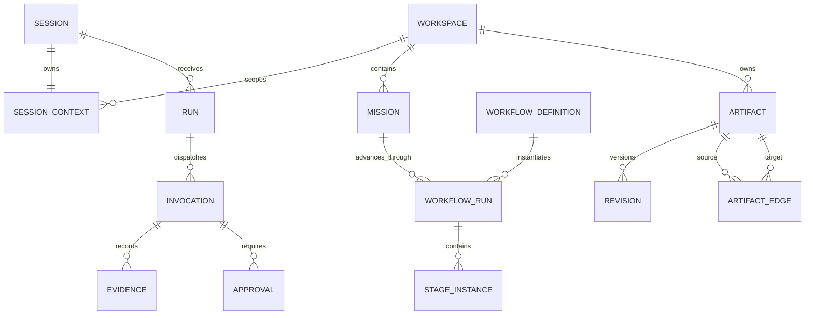
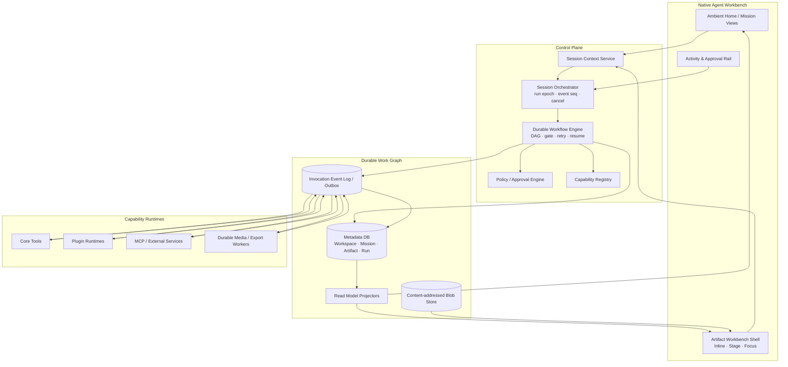

# 译宝 Agent OS：通用工作语境、业务对象本体与能力表面架构

> 状态：目标架构规格 v1，供后续实现与评审使用
> 日期：2026-09-01
> 来源：`做一个 Agent 概念科普视频` 溪场实机复测与跨领域压力测试
> 适用范围：视频、PPT、编码、数据分析，以及后续第三方 Workflow Pack / Capability
> 关联审计：[2026-09-01 Agent 概念视频溪场复测](../reports/2026-09-01-agent-concept-video-field-mode-review.md)

## 0. 结论

译宝的 OS 内核不应该以“聊天 + 插件页面”为基本模型，也不应该把 `Workspace` 与 `Session` 合并成一个桶。目标模型是：

> **Workspace 管持久作用域，Session 管对话连续性，Mission 管用户目标，WorkflowRun 管推进，Artifact Graph 管工作对象，Capability 管可替换能力；Inline / Stage / Focus 只表达同一对象的协作姿态。**

视频的“选题 → 脚本 → 分镜 → 渲染”和 PPT 的“主张 → 故事线 → 页面 → 导出”都只是领域包，不进入内核。内核只认稳定的对象、关系、状态、事件和合同。

这带来五个直接结果：

1. 切会话不会隐式切项目，切项目也不会污染其他会话；
2. 插件可以替换，任务和产物仍能继续；
3. 视频、PPT、编码、数据分析共用同一个运行与恢复内核；
4. Stage / Focus 不再是四套页面，而是同一 `ArtifactSurfaceSession` 的空间变体；
5. “完成”由产物验收决定，不由 Agent 说了一句成功决定。

---

## 1. 设计边界

### 1.1 OS 内核负责什么

- 身份、成员、权限和数据作用域；
- 会话、运行、打断、恢复和事件顺序；
- 目标、工作流、阶段、阻塞和验收；
- 产物、版本、关系、证据和来源；
- 能力发现、预检、调用、审批、成本与风险；
- Inline / Stage / Focus 的宿主壳、状态连续性和无障碍；
- 活动、通知、后台任务、同步和审计。

### 1.2 领域包负责什么

- 领域 Artifact schema；
- WorkflowDefinition 与阶段依赖；
- Artifact renderer / instrument；
- 领域验收器、导出器与降级策略；
- 领域词汇和用户可见的阶段名称。

### 1.3 不允许进入内核的领域假设

- 固定九段视频流程；
- `topic`、`article`、`slide`、`commit` 等具体类型判断；
- “有 script/doc 就到 S1”一类字符串推导；
- 某插件数据库中的 `project_id` 是全局关系权威；
- 所有工作都必须有 Project，或所有 Session 都必须绑定 Workspace。

---

## 2. Workspace 与 Session：两个正交维度

### 2.1 定义

`Workspace` 是**持久工作与治理边界**：成员、权限、能力策略、Artifact Graph、文件根、预算和保留策略都挂在这里。

`Session` 是**对话与注意力连续性**：消息、当前输入、对话摘要、运行槽和最近使用的工作对象挂在这里。

它们不是父子替代关系，也不能合并成 `WorkspaceSession` 实体。

```text
Workspace = where the work belongs
Session   = where the collaboration continues
Mission   = why the work exists
Artifact  = what is being made
Run       = what is happening now
```

### 2.2 绑定对象：SessionContext

`SessionContext` 是显式关联与读模型，不是新的业务容器：

```ts
interface SessionContext {
  sessionId: SessionId;
  workspaceId?: WorkspaceId;
  missionId?: MissionId;
  workflowRunId?: WorkflowRunId;
  activeArtifactId?: ArtifactId;
  activeRevisionId?: RevisionId;
  runEpoch: number;
  updatedAt: string;
}
```

硬规则：

1. 一个 Session 同一时刻最多绑定一个 Workspace，但可以处于无 Workspace 的临时态；
2. Session 可以显式切 Workspace，必须产生 `SessionScopeChanged` 事件并在 UI 可见；
3. Workspace 下可以有多个 Session；关闭 Session 不删除 Workspace、Mission 或 Artifact；
4. Session 引用其他 Workspace 的对象时，必须通过显式链接或临时授权，不能靠“全局当前项目”继承；
5. 新 Session 默认让用户选择“继承此 Workspace / 无 Workspace / 新建工作”，不能静默继承进程全局 setting；
6. 所有能力调用的真实作用域由 Host 注入，模型和插件不能自行扩大。

### 2.3 关系基数



### 2.4 Project 的去向

当前 `Project` 同时承担“工作语境、文件目录、对象引用集合、进度卡”四种职责，难以泛化。目标模型中：

- OS 内核使用 `Workspace` 作为治理与数据边界；
- 使用 `Mission` 表达可完成的目标；
- 使用 `ArtifactGraph` 表达对象关系；
- 使用 `WorkspaceHomeView` / `MissionCardView` 生成用户看到的“项目卡”；
- “项目”可以继续作为中文产品词，但不再对应一个重复的万能容器。

迁移期可保留 `Project` API 作为兼容 façade：`Project.id → Workspace.id`，`Project.objects[] → Artifact + WorkspaceArtifact`，`Project.dir → WorkspaceRoot`。对象之间的显式语义关系才进入 `ArtifactEdge`；进度卡改读活跃 `WorkflowRun`，不再从对象 type 字符串推导。

---

## 3. 通用业务对象本体

### 3.1 内核实体

| 实体 | 核心职责 | 不负责 |
|---|---|---|
| `Workspace` | 权限、数据边界、能力策略、预算、文件根 | 对话内容、具体流程阶段 |
| `Session` | 对话、输入、注意力与运行入口 | 产物所有权、项目全局状态 |
| `SessionContext` | 显式绑定当前工作语境 | 成为新容器、复制对象 |
| `Mission` | 目标、约束、完成定义、优先级 | 具体工具调用 |
| `WorkflowDefinition` | 可版本化的阶段图与验收规则 | 保存某次执行状态 |
| `WorkflowRun` | 某次工作流实例、阶段推进、阻塞与恢复 | 对话历史 |
| `StageInstance` | 一个阶段的输入、输出、状态、重试 | UI 的 Stage 表面 |
| `Artifact` | 稳定对象身份、类型、scope 与生命周期 | 直接塞入所有大内容 |
| `Revision` | Artifact 的不可变内容版本 | 工作区权限 |
| `ArtifactEdge` | 对象间显式语义关系 | 依赖 note 文本猜关系 |
| `Evidence` | claim、source、提取、可信度、验证时间 | 仅保存一个 URL |
| `Capability` | 可做什么、接收/产出什么、风险和运行语义 | 直接决定展示形态 |
| `Invocation` | 一次能力调用的持久日志和状态 | 代表整个 Mission 完成 |
| `Approval` | 对具体对象、revision、动作和作用域的裁决 | 泛化为“是否允许所有事” |
| `PolicyDecision` | 系统对风险、权限、成本的决策证据 | 替用户做高风险批准 |
| `Deliverable` | 已通过验收、可交付/导出的 Artifact 引用 | 与任意中间产物等价 |

### 3.2 重要区分

#### Run 不等于 WorkflowRun

- `Run`：Session 中一次 Agent 执行尝试，可被新输入打断；
- `WorkflowRun`：跨多个 Session、Run、重启仍存在的长期推进实例；
- `Invocation`：Run 或 WorkflowRun 调用某一 Capability 的一次原子记录。

因此，用户打断一次 Run，只应停止当前执行；已经写入的 Evidence、Artifact Revision 和 Workflow checkpoint 必须保留。

#### StageInstance 不等于 Stage 表面

- `StageInstance` 是业务流程节点，例如“证据核验”；
- `Stage` 是视觉协作表面，例如“把证据表和脚本画布并排打开”。

同一个 StageInstance 可以只用 Inline 完成，也可以在 Stage / Focus 中完成。一个 Stage 表面也可以同时展示多个相关 StageInstance 的产物。

### 3.3 Artifact 与 Revision

```ts
interface Artifact {
  id: ArtifactId;
  workspaceId: WorkspaceId;
  missionId?: MissionId;
  type: string;             // 例如 deck.document / video.timeline / code.patch
  schemaVersion: string;
  lifecycle: "draft" | "in_review" | "approved" | "published" | "archived";
  headRevisionId: RevisionId;
  owner: ActorRef;
  labels: string[];
  createdAt: string;
  updatedAt: string;
}

interface Revision {
  id: RevisionId;
  artifactId: ArtifactId;
  parentRevisionIds: RevisionId[];
  contentRef: BlobRef;
  contentHash: string;
  createdBy: ActorRef;
  createdByInvocationId?: InvocationId;
  createdAt: string;
}
```

Artifact 是稳定身份，Revision 是不可变内容。编辑器保存、Agent 改写、人工回滚都产生 Revision；UI 中“当前对象”指 Artifact，“当前版本”指 Revision。

### 3.4 ArtifactEdge

统一关系至少支持：

| 关系 | 含义 | 例子 |
|---|---|---|
| `contains` | 结构组成 | deck contains slide |
| `derived_from` | 内容推导 | script derived_from claims |
| `supports` | 证据支持 | evidence supports claim |
| `uses` | 运行时引用 | video timeline uses audio track |
| `supersedes` | 业务替代 | deck v2 supersedes deck v1 |
| `approved_by` | 人工裁决 | script approved_by approval |
| `rendered_from` | 导出来源 | pptx rendered_from deck document |
| `blocks` | 阻塞关系 | missing chart blocks slide export |
| `relates_to` | 弱关联，必须带语义标签 | research note relates_to slide 4 |

边必须带 `workspace_id`、创建者、来源 invocation、时间和可选 metadata。跨 Workspace 边需要独立授权记录。

### 3.5 Evidence

```ts
interface Evidence {
  id: EvidenceId;
  workspaceId: WorkspaceId;
  claim: string;
  source: { uri: string; title?: string; publisher?: string };
  locator?: { page?: number; section?: string; timecode?: string };
  excerptHash?: string;
  capturedAt: string;
  verifiedAt?: string;
  confidence: number;
  freshness?: { observedAt: string; expiresAt?: string };
}
```

Evidence 是一等对象，因为视频、PPT、研究报告和代码变更都需要可追溯依据。只把 URL 塞进 Markdown 不足以支持复核、更新和来源覆盖率验收。

---

## 4. Workflow Pack：把领域流程移出内核

### 4.1 合同

```yaml
id: deck.strategy-review
version: 1.0.0
domain: presentation
inputs:
  - type: brief.presentation
outputs:
  - type: deck.document
  - type: deck.export.pptx
stages:
  - id: evidence.collect
    requires: [brief.presentation]
    produces: [research.claim_set]
  - id: storyline.build
    requires: [brief.presentation, research.claim_set]
    produces: [deck.storyline]
  - id: slides.compose
    requires: [deck.storyline]
    produces: [deck.document]
  - id: deck.validate
    requires: [deck.document]
    produces: [quality.report]
  - id: deck.export
    requires: [deck.document, quality.report]
    produces: [deck.export.pptx]
acceptance:
  - check: source_coverage
    min: 0.95
  - check: text_overflow
    max: 0
  - check: unresolved_placeholders
    max: 0
  - check: export_openable
    equals: true
fallbacks:
  - when: image_generation_unavailable
    action: use_brand_library
```

### 4.2 Workflow 状态

```text
draft → preflighting → ready → running
                     ↘ blocked ↔ running
running → waiting_user → running
running → completed
running → failed → running
running → cancelled
```

只有所有必要 Deliverable 通过 acceptance，`WorkflowRun` 才能进入 `completed`。Agent 的 final text、工具的 `success=true`、界面的“已保存”都不是完成证明。

### 4.3 阶段不是线性数组

WorkflowDefinition 必须是 DAG，支持：

- 视频的视觉、配音并行；
- PPT 的文案、图表、视觉素材并行；
- 编码的测试、lint、build 并行；
- 数据分析的数据质量门先于结论生成；
- 人工审核 gate、条件分支、重试和替代 Capability。

UI 可以把 DAG 投影成线性“当前步骤”，但不能把这个投影反写成内核真相。

### 4.4 插件注册

插件可在 `manifest.toml` 中声明 `[[workflow]]`，Host 加载期完成 schema 与正则校验，再注册进 `workflow_definitions`。插件不能覆盖 core 的同 id、同版本定义；新版本只影响新建 WorkflowRun，已存在的 Run 继续锁定原定义与版本，避免升级后进行中的任务漂移。

---

## 5. Capability 合同

### 5.1 声明

```ts
interface CapabilityDescriptor {
  id: string;
  version: string;
  provider: ProviderRef;
  accepts: ArtifactTypeRef[];
  produces: ArtifactTypeRef[];
  effects: Array<"read" | "write" | "external_write" | "execute" | "publish">;
  risk: RiskDescriptor;
  permissions: PermissionRequirement[];
  dataScopes: Array<"artifact" | "mission" | "workspace" | "global">;
  idempotency: "none" | "keyed" | "natural";
  execution: {
    mode: "sync" | "job" | "stream";
    cancel: "immediate" | "checkpoint" | "unsupported";
    resume: boolean;
    progress: boolean;
  };
  estimates?: { timeMs?: Range; cost?: MoneyRange };
  renderers?: RendererDescriptor[];
  suggestedSurfaces: Array<"inline" | "stage" | "focus">;
}
```

插件 tool 可声明一个通用 `work_output`：`artifact` 或 `evidence`。字段只允许从安全 result 与显式选定的 params 路径投影；执行入口不按插件名判断业务语义。

```toml
[tool.work_output]
kind = "artifact"
artifact_type = "deck.document"
ref_from = "data.id"
content_ref_from = "data.path"
metadata_fields = ["data.version"]
```

对话调用和面板直调均通过唯一 `ToolInvoker`：执行前写 `Invocation(running)`；带 `db + work_output` 的插件调用把领域写入与 PluginDb outbox 放入同一 SQLite 事务，再由 Host 以稳定事件 id 幂等接收、投影 Artifact、Revision 或 Evidence 并回写确认。进程若恰好崩在插件提交与 Host 接收之间，启动时会从 PluginDb 重放；没有 `conversation_id → Workspace` 绑定时，Host 事件保持 `blocked`，不得回退猜测全局项目。

### 5.2 宿主裁决

插件只能提出 `suggestedSurfaces`，Host 根据以下信息做最终裁决：

- 用户是否明确要求打开/编辑/专注；
- 当前 Artifact 与选择范围；
- 内容密度、instrument 最小尺寸；
- 风险、待批准动作、运行时长；
- 设备和窗口尺寸；
- 用户的 reduced motion、无障碍和专注偏好。

模型或插件自动触发时最多产生 Inline 或宿主瞬态 compact preview；Stage / Focus 需要明确用户意图。

### 5.3 调用与事件

所有事件至少包含：

```text
workspace_id
session_id
conversation_id
run_id
run_epoch
workflow_run_id?
invocation_id
event_seq
artifact_refs[]
timestamp
```

客户端只允许当前 `run_epoch` 的事件改变活动状态。旧 epoch 的迟到事件仍写入审计日志和 Artifact Graph，但不得改写当前会话 UI。

---

## 6. Inline / Stage / Focus：通用视觉交互语法

### 6.1 三态不是三套应用

三态共享同一个 `ArtifactSurfaceSession`：

```ts
interface ArtifactSurfaceSession {
  id: string;
  sessionId: SessionId;
  workspaceId: WorkspaceId;
  artifactId: ArtifactId;
  revisionId: RevisionId;
  rendererId: string;
  presentation: "inline" | "stage" | "focus";
  selection?: unknown;
  scroll?: unknown;
  draftRef?: BlobRef;
  inspectorState?: unknown;
  originAnchorId?: string;
}
```

切换 presentation 不得重建插件运行时，不得改变 Artifact，不得丢选择、草稿、滚动、撤销栈或 pending approval。

### 6.2 Inline：宿主原生语法

Inline 由宿主渲染，插件提供结构化数据。基础原语：

- `IntentCard`：目标、受众、约束、交付物、缺失项；
- `ChoiceCard`：2–5 个可比较候选，有稳定 id、差异字段、选中和撤回；
- `ApprovalCard`：动词优先，显示作用对象、影响范围、风险和到期；
- `ProgressCapsule`：阶段、进度、耗时、暂停/取消/恢复；
- `ResultReceipt`：完成了什么、产物、版本、撤销/展开；
- `EvidenceChip`：claim、来源、置信度、更新时间；
- `BlockerCard`：缺能力、缺权限、缺输入以及可选解决路径；
- `ArtifactPreview`：当前对象的轻量预览和“打开工作台”；
- `CapabilityGapCard`：明确当前只能做到哪一步，不把安装问题伪装成任务完成。

每个 Inline 对象都必须显示：Workspace/Mission scope、对象名、业务状态、来源和一个主动作。工具名退到二级详情。

### 6.3 Stage：Artifact Workbench Shell

Stage 是宿主稳定壳，不是插件 iframe 的放大版。它包含五个可组合槽位：

1. **Object Header**：Workspace / Mission / Artifact breadcrumb、版本、保存与同步状态；
2. **Navigator**：对象结构、相关产物或 workflow stage；
3. **Instrument Canvas**：插件/能力提供的领域操作器；
4. **Inspector / Evidence Rail**：属性、证据、评论、风险、版本差异；
5. **Shared Composer / Activity Rail**：仍然对译宝说话，展示运行、审批、阻塞和恢复。

宿主拥有：壳、scope、对象身份、版本、选择同步、审批、活动、动效、键盘和无障碍。插件拥有：Instrument Canvas 与声明式 inspector sections。

### 6.4 Focus：同一工作台的注意力变体

Focus 只改变空间和信息密度，不改变业务对象。Renderer 可以声明 Focus 子模式，但它们不是新的 OS surface：

- `edit`：最大化生产画布；
- `read`：隐藏编辑器 chrome，优化长内容阅读；
- `review`：突出 diff、批注和验收；
- `present`：用于 PPT 放映、视频预览或结果演示。

`Esc` 的固定语义：

```text
关闭临时菜单/选择 → Focus 回 Stage → Stage 收回 Inline 锚点 → 回到任务现场
```

### 6.5 Peek 的定位

Peek 不进入插件公共状态枚举。它是 Host 对 Stage 的瞬态 compact placement：

- 不拥有导航历史；
- 不成为恢复点；
- 不改变 active Artifact；
- 完成、点击空白或 Esc 后回到原锚点；
- 明确要求“打开编辑器”时不得先强塞 Peek。

### 6.6 响应式

| 宽度 | Stage 布局 | 必须保留 |
|---|---|---|
| `≥1280` | Navigator + Canvas + Inspector，活动轨可见 | Workspace/Mission、对象、版本、运行状态 |
| `900–1279` | Navigator 抽屉；Canvas + 可收 Inspector | scope pill、共享输入、活动入口 |
| `<900` | Canvas 主导；结构与 inspector 进入 bottom sheet | 当前 Workspace/Mission pill，不能退化为“全局当前项目” |

小窗/桌宠不复制大窗布局，但必须共享 scope、运行和裁决语义；呈现可以是紧凑卡、活行和通知。

### 6.7 动效与连续性

- Inline → Stage 从真实 `originAnchorId` 对应矩形生长，建议 220–280ms；
- Stage → Focus 使用同一画布与对象 header 做连续变形，不闪白、不 remount；
- 后台运行时收起 Stage，只把对象收束到活动胶囊，不取消任务；
- `prefers-reduced-motion` 下取消缩放和大位移，保留淡入与状态可读性；
- 动效结束与业务状态更新分离，不能用“动画播完”代表“保存完成”。

---

## 7. 四领域压力测试

| 领域 | Mission | Artifact 链 | Stage | Focus | 完成验收 |
|---|---|---|---|---|---|
| 视频 | 做 60 秒 Agent 科普成片 | brief → claims → script → storyboard → visual/audio → timeline → render | 分镜/时间线工作台，证据与素材轨 | 单镜头编辑、脚本阅读、成片预览 | 时长、比例、未核验主张、缺镜头、音画、可播放导出 |
| PPT | 做 12 页策略汇报 | brief → claims → storyline → slide specs → charts/images → deck → pptx/pdf | 左侧缩略图 + 当前画布 + 证据/讲者备注 | 单页编辑、叙事排练、放映 | 页数、比例、字体、溢出、来源覆盖、可打开导出 |
| 编码 | 修复一个可验证问题 | issue → repo snapshot → plan → patch → test evidence → build/release | 代码、终端、diff、测试同场 | 单文件编辑、diff review、运行结果 | 测试、lint、安全、review、构建或发布边界 |
| 数据分析 | 回答一个业务问题 | question → data snapshot → quality report → metric defs → query/notebook → chart → insight report | 数据探查、notebook、图表、口径同场 | 图表精读、查询审查、报告阅读 | 数据新鲜度、质量、可复现、口径正确、结论证据 |

### 7.1 同一套对象如何覆盖 PPT

```text
Workspace: Q3 strategy
Mission: 在周五评审前完成 12 页策略汇报
WorkflowRun: deck.strategy-review@1.0.0
Artifacts:
  brief.presentation
  research.claim_set
  deck.storyline
  deck.slide_spec[]
  chart.spec[]
  asset.image[]
  deck.document
  deck.export.pptx
Evidence:
  supports claim → used_by slide
Capability:
  outline.generate / chart.render / slide.compose / deck.export
```

用户在 Inline 选故事线，进入 Stage 后同一对象变成缩略图 + 画布 + 证据区，Focus 时只扩大当前页或进入放映。切换形态不创建三个不同 deck，也不需要跳进“PPT 插件页面”。

### 7.2 泛化是否成立的反证问题

每个新增领域必须回答：

1. 去掉领域专有名词后，是否仍能落在上述内核实体？
2. 是否需要新增业务实体，还是只需要新的 Artifact schema / edge / renderer？
3. 能力失败后，WorkflowRun 是否能换 provider 从 checkpoint 继续？
4. 同一 Artifact 在 Inline / Stage / Focus 间是否保持同一个 id 和 revision？
5. 不打开某插件页面，用户是否仍能完成主路径？
6. 完成能否由 acceptance 自动或人工验证，而不是听 Agent 自报？

若第 2 问总是要求改内核，说明本体仍被某个领域绑架；若第 5 问为否，说明插件仍是目的地而不是能力。

---

## 8. 目标系统架构



### 8.1 数据原则

本地优先版本建议：

- 一个 SQLite WAL metadata store 保存 Workspace、SessionContext、Mission、WorkflowRun、Artifact、Revision metadata、Edge、Invocation、Approval；
- 大文本、图片、音频、视频、PPTX 等进入 content-addressed BlobStore；
- 插件可以保留领域库，但任何跨域关系都通过 transactional outbox 发布成 Artifact / Edge；
- Project/插件双写不得再作为一致性方案；
- Read Model 从事件投影，Home 卡、Mission 进度、活动轨都不是权威数据源。

面向同步与团队扩展：所有 id 使用全局唯一值，事件带 actor/device/logical clock，Revision 不可变；冲突发生在可合并的内容层，不发生在“全局当前项目”setting。

### 8.2 运行原则

- Run 状态：`queued → running → waiting_user / blocked → done / failed / cancelled`；
- 每个 tool result 立即写 Invocation Log，不能等 final reply 才落整轮；
- 用户打断只改变当前 Run / Invocation，已提交 Revision 和 Evidence 不回滚；
- 长媒体、导出、索引任务使用 durable job，关闭窗口后继续，重启可恢复；
- `speech_stop`、`run_cancel`、`job_cancel` 是三个不同命令；
- 风险由 `Capability.effects + typed parameters + target scope` 决定，不扫描自然语言关键词猜危险级别。

---

## 9. 从当前实现迁移

### Phase 0：先统一语言与边界

- 文档和新接口停用 `WorkspaceSession`；
- 将 `Project` 明确为迁移 façade / 产品词，不再新增职责；
- 给所有新事件补 `workspace_id / session_id / run_epoch / event_seq`；
- 停止增加视频专用的 core 常量和对象字符串推导。

### Phase 1：Workspace / Session 正交化

- 新建 metadata schema：Workspace、Session、SessionContext；
- 把全局 `current_project_id` 迁成 per-session binding；
- 切换工作语境产生 `SessionScopeChanged`；
- Host 对 list/search/open 注入 scope；
- 旧 ProjectStore 只作为一次迁移来源和兼容 API。

### Phase 2：Artifact Graph 与即时事件日志

- 将 topic、article、material 映射为 typed Artifact；
- 将 Project.objects 映射成 Artifact + WorkspaceArtifact；对象间关系映射为 ArtifactEdge；
- tool result 即时写 Invocation / Evidence / Revision；
- 插件域通过 outbox 发事件，消灭 `project.attach + plugin.project_id` 双写。

当前落地：`work_graph.db` 已建立 Workspace、Mission、Artifact、不可变 Revision、ArtifactEdge、WorkflowDefinition、WorkflowRun、StageInstance、Invocation、Evidence 与 Host outbox；legacy `projects.json` 只迁移一次，后续对象写入以 Work Graph 为权威。`PluginDb` 已内建 transactional outbox，Host 以稳定插件事件 id 充当 inbox 幂等键，并在启动时扫描未确认事件恢复。`zimeiti.add / article_save / mat_save` 已改为声明产出，数据库业务写入与领域事件原子提交，成功后自动投影，不再要求 Agent 手工 `project.attach`。

大内容层也已落地第一版：共享 BlobStore 支持 bytes、text 与流式文件 staging，以 `blob://sha256/<hash>` 形成位置无关引用；tool 在 PluginDb 提交前原子 promote，outbox 只发布已经存在的内容哈希。这样崩溃不会产生“数据库已提交但文件不存在”，最坏只留下无引用对象；Host 启动时从 Revision 与 outbox 生成保守 live set，经过七天宽限期回收过期 staging 与孤儿对象。`article_save / read / publish / get / wewrite` 已接入，旧相对路径和绝对路径继续只读兼容。

剩余边界：BlobStore 目前解决单机持久化、去重、崩溃顺序与孤儿回收，还没有团队同步、分片上传、加密域、配额和显式 retention policy；领域删除也不会立即物理清除仍被不可变 Revision 引用的内容。下一阶段应扩展 ArtifactEdge 事件、DAG gate、长任务 checkpoint，并用真实 `deck.export.pptx` 与视频渲染文件验证大二进制流式写入及同步策略。

### Phase 3：Workflow Engine 与两个对照 Pack

- 先实现 `video.explainer.60s` 与 `deck.strategy-review`；
- 用两个差异足够大的领域逼出 DAG、acceptance、fallback、并行和 resume；
- Home 项目阶段改读活跃 WorkflowRun，不再读 `PROJECT_STAGES` 常量。

### Phase 4：通用 Artifact Workbench Shell

- 宿主统一 Object Header、Navigator、Canvas、Inspector、Shared Composer；
- renderer contract 接视频 / deck / coding / data；
- `ArtifactSurfaceSession` 持久化选择、滚动、草稿和 presentation；
- Peek 降为 Host placement，插件只声明三态支持。

### Phase 5：同步、团队与商业化

- 多设备事件同步和 revision 冲突处理；
- Workspace 成员、角色、审批和共享；
- Workflow Pack 商店与 Capability provider 替换；
- 以可验收 WorkflowRun、算力、协作治理和品牌资产计费，而不是以“装插件”计费。

---

## 10. 架构不变量与验收

以下不变量应成为自动化测试和真机验收线：

1. 两个 Session 可同时绑定同一 Workspace，但 active Artifact、draft、run 和 presentation 互不污染；
2. 一个 Session 显式切 Workspace，不影响其他 Session；
3. 无 Workspace 的 Session 调用 workspace-scoped 能力时必须先绑定或明确创建；
4. 所有 list/search 默认只返回 SessionContext 作用域内对象；切全局必须显式且可撤回；
5. Run 被打断后，已经完成的 Invocation、Evidence 和 Revision 可在新 Run 中继续使用；
6. 同一 WorkflowDefinition 更换 Capability provider，Artifact contract 与 acceptance 不变；
7. 视频和 PPT 都能走完 Mission → WorkflowRun → Deliverable，不改 OS 内核 schema；
8. Inline → Stage → Focus → Stage → Inline 后 Artifact id、Revision、选择、滚动、草稿和撤销栈保持；
9. Stage 收起或应用重启后，durable job 和待审批项仍可追踪、停止和恢复；
10. UI 的“完成”必须能反查 acceptance report 与 Deliverable，不接受裸 final text；
11. 1040px 和更窄窗口仍能看见当前 Workspace/Mission，不允许退回隐式全局项目；
12. VoiceOver / 键盘可读出当前 scope、对象、版本、运行状态和退出路径；Reduced Motion 下主路径完整。

---

## 11. 实现决策摘要

| 决策 | 结论 |
|---|---|
| `WorkspaceSession` 是否保留 | 否；拆为 Workspace、Session 与关联读模型 SessionContext |
| Project 是否删除 | 产品词可保留；内核职责拆给 Workspace、Mission、ArtifactGraph、Read Model |
| 视频九阶段放哪里 | `video.explainer` Workflow Pack，不进 core |
| Peek 是否第四态 | 否；Host 的瞬态 compact placement |
| 插件是否拥有页面 | 不拥有顶层目的地；提供 Capability 与 Artifact renderer |
| Stage / Focus 是否重建插件 | 否；同一 ArtifactSurfaceSession 改 presentation |
| 完成由谁判断 | Workflow acceptance + Deliverable |
| 跨域关系谁权威 | Artifact Graph；插件通过 outbox 发布 |
| 当前项目/工作区存哪里 | per-session SessionContext，不是进程全局 setting |
| 首批泛化验证 | 视频 + PPT，随后编码 + 数据分析 |

---

## 12. 当前代码的迁移落点

| 当前实现 | 现状含义 | 目标改造 |
|---|---|---|
| [`config.py`](../../sidecar/src/yibao_brain/config.py) 的 `current_project_id` | 进程全局工作语境 | 迁入 per-session SessionContext；setting 只保留最近使用偏好，不作为调用 scope |
| [`projects.py`](../../sidecar/src/yibao_brain/projects.py) 的 ProjectStore | JSON 引用集合、目录锚点 | 一次迁入 Workspace / Artifact / Revision；保留兼容 façade，停止新增关系字段 |
| [`project_tools.py`](../../sidecar/src/yibao_brain/project_tools.py) | Agent 手工 create/open/attach | 改为 Workspace / Mission command；跨域 attach 由 Artifact event / outbox 完成 |
| [`runs.py`](../../sidecar/src/yibao_brain/runtime/runs.py) | per-conversation 运行槽与抢占 | 保留 Session 级调度，引入持久 run id、run_epoch、event_seq 与 Workflow checkpoint |
| [`history.py`](../../sidecar/src/yibao_brain/history.py) | per-conversation 最近消息桶 | 升级为 Session message store；Invocation / Evidence 独立即时落盘，不再依赖整轮 history |
| [`project-card.ts`](../../desktop/src/lib/home/project-card.ts) | 视频九阶段硬编码、按 type 字符串猜进度 | 改读 `MissionCardView(active WorkflowRun)`；阶段标签来自 WorkflowDefinition |
| [`capability-surfaces-design.md`](../research/2026-08-09-capability-surfaces-design.md) | 四级表面实现演进 | 公共合同收敛三态；Peek 只保留为 Host placement |

第一刀不应先做 PPT 编辑器，也不应继续补视频阶段字符串。应先把 `current_project_id` 从全局真相降级，建立 `SessionContext + workspace-scoped query`，否则任何新领域都会复制当前串线问题。
