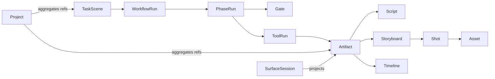

# 「做一个 Agent 概念科普视频」全流程产品审计

> 日期：2026-08-31  
> 对象：译宝 macOS 桌面应用（debug `.app`）  
> 方法：只操作 Mac 应用，不使用浏览器；用真实对话、审批、插件表面和本地持久化数据走查。  
> 目标：检验陪伴式 Agent OS、原生 Agent 工作台，以及 Inline / Stage / Focus 三态是否形成一条可扩展、可恢复、可交付的任务链。

## 1. 结论

当前产品已经做出了一个有辨识度的 **Agent OS 表面原型**，但还没有形成 **Agent OS 业务内核**。

最成立的是空间语法：能力从对话旁边长出，能从轻预览进入 Stage，再进入 Focus；共享输入仍在，Esc 能逐级退出。它不像跳去一个插件网站，这是正确方向。

最根本的问题是：**表面跑得比任务本体快。** 这次 case 最终落下的是：

- 1 个自媒体选题对象；
- 1 个 Markdown 脚本版本；
- 1 条把 7 个镜头压成大段文本的素材记录；
- 1 个只有名字、目录骨架和两个引用的项目；
- 1 个 7.9KB 的 HTML 概念展示面板。

没有落下：`Task`、`WorkflowRun`、`PhaseRun`、`video.storyboard`、`Shot`、图片 `Asset`、配音、时间线或成片。换句话说，系统能“说正在做视频”、能“摆出一个视频工作台”，但业务对象仍主要是对话文本和插件私有记录。

### 综合判断

| 维度 | 现状 | 判断 |
|---|---:|---|
| 产品逻辑 | 5.5 / 10 | 关键选择与审批已有，但立项太晚、承诺早于能力检查、阶段不可恢复 |
| 业务/领域建模 | 3 / 10 | 项目只是引用集合；任务、流程、阶段、制品和血缘均未成为一等对象 |
| 系统架构 | 5 / 10 | 工具注册与表面裁决有底座，但状态源分裂、插件私有 UI、长任务无统一 job 语义 |
| 形态创新 | 7 / 10 | Stage / Focus 的“同一工作台内生长”已经有产品辨识度 |
| 交互与动效 | 5 / 10 | 三态可走，但上下文丢失、自动 Peek 抢注意、动效无真实来源锚点 |
| 视觉与可访问性 | 4.5 / 10 | 视觉统一但层级弱；全局权限卡压住任务；小控件、低对比、AX 树存在风险 |
| 可扩展/可伸缩性 | 3.5 / 10 | 新垂直任务仍要靠插件私有页面和自由文本，无法靠 schema + 宿主器械扩展 |

## 2. 真实完成边界

这次没有把“生成了面板”当成“生成了视觉样张”，也没有把“脚本保存成功”当成“视频完成”。

已验证的真实产物：

- 项目：`Agent 概念科普视频`；
- 项目引用：`zimeiti.topic`、`zimeiti.material` 各 1 个；
- 脚本：`v1.md`，文件 717 字符，其中口播自报约 260 字；
- 分镜：7 镜，但只存在一条 `material.content` 文本中；
- 视觉面板：`gen_panels/agent-video-mockup.html`，7971 bytes，内含 CSS/SVG 的两帧概念排版；
- 项目目录：`01_素材/02_工程/03_导出/04_文档`，均为空目录。

未验证、也未产出的真实制品：

- 两张图片样张文件；
- 插画/录屏素材资产；
- TTS 配音文件；
- 时间线 JSON；
- 可播放粗剪；
- 60 秒成片。

产品最后能诚实承认当前缺少图片生成、配音和剪辑合成工具，这是优点；但这个边界应该在任务开始时完成能力预检，而不是到流程后段才暴露。

## 3. 全流程走查

| # | 操作与结果 | 健康度 | 主要问题 | 证据 |
|---:|---|---|---|---|
| 0 | 启动应用并进入主屏 | 差 | 三项电脑控制权限组成的大卡常驻任务顶部，遮住约三分之一到二分之一工作区；本次内容创作尚不需要这些权限 | [01-start](assets/2026-08-31-agent-video-flow/01-start.png)、[02-workbench](assets/2026-08-31-agent-video-flow/02-workbench.png) |
| 1 | 提交“60 秒中文竖屏 Agent 科普视频”完整目标 | 中 | 能理解端到端意图，但没有先做 capability preflight，也没有建立可见 Task / Workflow | [03-task-submitted](assets/2026-08-31-agent-video-flow/03-task-submitted.png) |
| 2 | 给出 3 个选题方向并停下来等选择 | 中上 | 决策点正确；但三个方案是长文本，不是同源的 Inline 对象卡，首屏还被权限卡遮挡 | [04-topic-options](assets/2026-08-31-agent-video-flow/04-topic-options.png) |
| 3 | 选择“生活类比 + 认知差”，进入资料核实 | 中 | 能按用户要求区分原始事实、归纳和比喻；但一度把二手来源标成“已核实”，随后才补官方/原文，验证状态语义不严谨 | [05-research-framework](assets/2026-08-31-agent-video-flow/05-research-framework.png) |
| 4 | 素材库自动以 Peek 长出 | 中 | 没跳页面，符合宿主内生长；但未经明确查看意图就弹出，且混入 Pulsar、Vibe Coding 等全局历史素材，当前任务没有拥有数据视图 | [06-material-surface-inline](assets/2026-08-31-agent-video-flow/06-material-surface-inline.png) |
| 5 | Peek → Stage → Focus → Esc 返回 | 中上 | 三态主路径成立，共享输入仍在；但 Focus 退出后左右栏没有恢复，当前上下文被破坏 | [07-material-stage](assets/2026-08-31-agent-video-flow/07-material-stage.png)、[08-material-focus](assets/2026-08-31-agent-video-flow/08-material-focus.png)、[09-collapsed-context-lost](assets/2026-08-31-agent-video-flow/09-collapsed-context-lost.png) |
| 6 | 生成脚本并触发“保存稿件”审批 | 中上 | “模型写入 → 人按印 → 持久化”链路有效；审批卡却没有提供即将保存内容的完整预览或 diff | [10-save-draft-approval](assets/2026-08-31-agent-video-flow/10-save-draft-approval.png) |
| 7 | 保存后打开选题详情和编辑器 | 中 | 数据能继承；但明确“打开编辑器”仍先落到 460×420 Peek，双栏编辑器在这个密度不可用，需人工再升 Stage | [11-topic-detail-after-save](assets/2026-08-31-agent-video-flow/11-topic-detail-after-save.png)、[12-script-editor-inline](assets/2026-08-31-agent-video-flow/12-script-editor-inline.png) |
| 8 | 在 Stage 要求分镜与 3 个视觉方向 | 中 | 能继续对话并给出方向；Stage 内看不到完整生成过程，语音播报、Agent 运行、插件工作三个状态没有清晰分开 | [13-visual-style-options](assets/2026-08-31-agent-video-flow/13-visual-style-options.png) |
| 9 | 选择视觉方向，要求把分镜/素材落成项目对象 | 差 | 到此时才创建项目：选题、研究、脚本和分镜先于 Project 出现，业务因果倒置 | [14-project-creation-approval](assets/2026-08-31-agent-video-flow/14-project-creation-approval.png) |
| 10 | 项目创建并挂入选题、分镜素材 | 差 | 分镜没有变成 Storyboard / Shot；项目只挂两条自由引用，阶段仍只能推成 S0/S1 |
| 11 | 请求生成 2 张视觉样张 | 差 | UI 长时间显示“生成面板”，但地平线同时显示项目 `idle`；后来只生成 HTML 展示面板，不是可复用图片 Asset | [15-visual-sample-result](assets/2026-08-31-agent-video-flow/15-visual-sample-result.png)、[16-visual-sample-timeout](assets/2026-08-31-agent-video-flow/16-visual-sample-timeout.png) |
| 12 | 追问实际文件、对象、配音与成片能力 | 中上 | 最终边界说明诚实；但它发生得太晚，说明计划、能力账本和执行器没有在开工前闭环 | [17-capability-boundary](assets/2026-08-31-agent-video-flow/17-capability-boundary.png) |

另有一个真实的时序问题：界面已经显示 `idle / 等待下一步` 时立即发送下一条指令，会把上一轮标成“已打断”；重试后“已打断”又被拼到新回复开头。调度器的槽位仍认为上一任务未收尾，但前端已宣布可继续，属于可见状态与可受理状态不一致。

## 4. 做对的部分

### 产品逻辑

- 对复杂任务先给 3 个方向，并在关键选择处停下来；
- 两个真正会写入状态的动作——保存稿件、创建项目——都走了显式审批；
- 对“会不会自动下单”的边界处理正确：方案可以生成，购买前停下等人确认；
- 最终没有虚构图片、音频或视频已经生成。

### Agent OS 形态

- 能力表面仍在译宝工作台里，不是把用户送到插件页；
- Stage / Focus 都保留了任务级输入；
- Focus 退出遵循 `Focus → Stage → 收起` 的渐进 Esc；
- 插件结果通过宿主裁决，代码上限制模型/插件最多自动打开到 Peek，这个信任边界是对的；
- 写入闸门落回对话流，而不是藏在瞬态面板里。

这些不是小修饰，而是产品最有价值的“骨相”。问题在于同一空间里承载的对象和状态还没有跟上。

## 5. 核心问题

### P0-1：没有一等 Task，任务散落在对话、项目、插件和 UI 状态里

当前“做一个视频”同时存在于：会话文本、选题、稿件、素材、项目名、生成面板、地平线 `ctx` 和若干前端 ref。任何一层都无法回答：

- 当前目标是什么；
- 现在走到哪一阶段；
- 等谁；
- 已产出哪些可验证制品；
- 下一步是什么；
- 能否从这里恢复。

因此右侧“本次”仍可能显示旧会话标题，项目又显示另一个名字，工具在转、地平线却 `idle`。这不是文案同步问题，而是缺少统一任务本体。

### P0-2：Project 创建太晚，而且语义过薄

设计文档本来规定：选题确认后立项，创建 Project，再进入脚本。实际是脚本、分镜和风格都完成后才立项。

当前 ProjectStore 只保存 `id/name/dir/objects[]`；`project.attach` 接受任意 `type/ref` 字符串，不验证类型是否注册、引用是否存在、对象是否属于当前任务。它更像书签集合，不是可恢复的工作语境。

项目卡的 S0–S8 进度也不是业务状态，只是检查 `objects.type` 里是否包含 `script/doc`；待确认数恒为 0。这会制造“看起来有流程，实际没有流程”的假确定感。

### P0-3：制品没有类型，文本替代了业务对象

7 个镜头被压进一条 `zimeiti.material.content`。系统无法：

- 单独选择第 3 镜；
- 给第 3 镜生成 3 个首帧变体；
- 把口播第 2 段绑定到某个镜头；
- 标记一个镜头为 approved、另一个为 failed；
- 局部重生成而不动其余镜头；
- 把图片、音频、视频的血缘传给时间线。

同样，“视觉样张”是一个展示 HTML，不是 `Asset(image)`。它不能进素材库、不能比较版本、不能被 Shot 引用、不能进入导出。

### P0-4：成功语义没有以产物为准

在样张步骤，生成过程卡还在转，项目地平线已经 `idle`；系统后来落了 HTML 面板，但没有图片文件。当前状态由聊天 run、panel state、project ctx、TTS 和 tool 调用分别维护，缺少一个统一 reducer。

正确的不变量应该是：

> 一个 Phase 只有在声明的 output refs 已经存在、通过 schema 校验并可 resolve 时，才能进入 success。

“LLM 回了一段话”“面板注册成功”“目录创建成功”都不能替代 `Asset` 产出成功。

### P0-5：开工前没有能力预检

用户一开始要求的是从策划到成片。系统在前半程接受了这个目标，直到样张以后才说明缺少图片生成、TTS 和合成能力。

应在任务建立时把目标拆成阶段，再对每个阶段做 capability resolution：

- `research`：available；
- `script`：available；
- `storyboard`：partially available；
- `image_asset`：no provider；
- `tts`：no artifact-producing provider；
- `timeline/render`：unavailable。

然后让用户选择：只做到分镜包、连接外部提供方、或切换到已有模板。Agent OS 的可信度首先来自“不在能力外承诺”。

### P0-6：Focus 破坏现场，违背“位之间传对象”

`HomeChat.vue` 在 Focus 时把左右栏设为关闭，但退出时没有恢复先前值。实际表现就是从 Focus 回 Stage、再收起后两侧语境仍然消失。

当前只持久化 `panel/visible/presentation`，没有把这些状态一起放进 `SurfaceSession`：

- active object；
- selection；
- scroll position；
- input draft；
- left/right rail state；
- instrument-local mode；
- pending diff / gate。

所以“继续项目”仍然更像翻会话，而不是恢复现场。

## 6. 三态模型需要重新定名

产品对外应该坚持用户要的三态：

1. **Inline**：Agent 交付与轻决策；
2. **Stage**：人和 Agent 在一个对象上协作；
3. **Focus**：人对一个对象做高密度裁决。

`Peek` 有价值，但不应该成为与三态平级的“第四个插件状态”。它更适合定义为 **Transient Preview（瞬态预览）**：是 Inline 结果的临时放大、也是 Agent 主动性的礼貌出口；它不拥有任务、不拥有持久导航、不成为恢复点。

当前代码把 `inline | peek | stage | focus` 全部塞进一个 `Presentation` 枚举，导致“任务模式”“对象密度”“弹层策略”混在一起。建议拆为：

```ts
type WorkspaceMode = "inline" | "stage" | "focus";
type TransientLayer = "none" | "peek";
type Attention = "quiet" | "suggest" | "requires-decision";
```

这样能同时保住三态心智和 Peek 的主动陪伴价值。

## 7. 目标业务本体

建议把领域对象收敛为下面这组。Plugin 不再是页面，而是给这些对象提供能力、数据适配和可选 renderer。



### 核心实体

```text
TaskScene {
  id, goal, project_ref, workflow_ref,
  current_phase, active_object_ref,
  status, blocked_reason, next_action
}

WorkflowRun {
  id, template_id, task_ref,
  phase_runs[], gates[], status,
  capability_plan, budget
}

PhaseRun {
  id, phase_type,
  input_refs[], required_output_types[], output_refs[],
  status: queued|running|waiting_user|blocked|failed|succeeded
}

Artifact {
  id, type, version, status,
  project_ref, lineage, created_by_run,
  file_refs[], referenced_by[]
}

Gate {
  id, action, risk, preview_ref, diff_ref,
  decision, decided_by, decided_at
}

ToolRun {
  id, capability_id, provider_id,
  status, progress, cancelability,
  input_refs[], output_refs[], error
}

SurfaceSession {
  task_ref, artifact_ref, instrument,
  mode, selection, scroll, draft,
  rail_state, pending_gate_ref
}
```

视频域只扩展 Artifact，不重新发明整套页面：

- `video.script`：口播文本、文档总字数、口播字数、时长估算、平台变体；
- `video.storyboard`：shot refs；
- `video.shot`：台词引用、时长、叙事目的、画面描述、资产槽、变体和选中项；
- `video.asset`：image/audio/video，文件、模型参数、prompt、父资产、状态；
- `video.timeline`：轨道、clip refs、in/out、效果与版本；
- `video.export`：文件、编码参数、timeline version、验证结果。

## 8. 可伸缩架构

### 8.1 五层而不是“插件 + 面板”两层

1. **Agent OS Kernel**  
   任务、项目、workflow reducer、object registry、job queue、gate、权限、预算、审计事件。

2. **Host Instruments**  
   编辑器、Diff、结构化表格、Storyboard、Canvas、Asset Rail、Timeline。一个器全库一份，宿主拥有交互和可访问性。

3. **Domain Packs**  
   比如 `video-creation`。只声明对象 schema、workflow template、校验器、默认策略和器械绑定，不拥有顶层页面。

4. **Capability Providers**  
   研究、图片生成、TTS、剪辑/渲染等适配器。Provider 必须声明输入/输出类型、成本、风险、权限、取消能力和 SLA。

5. **Surface Projection**  
   根据 UserIntent、active object、内容密度、风险和 instrument 最小尺寸决定 Inline / Stage / Focus；Peek 只是瞬态层。

### 8.2 单一事件流

把现在分散的 chat state、panel state、project ctx、TTS state 和 tool spinner 收敛为事件：

```text
task.created
workflow.planned
phase.started
tool.started / progress / blocked / failed / succeeded
artifact.created / versioned / approved
gate.requested / decided
surface.opened / focused / restored
phase.succeeded
```

所有 UI 状态都由同一个 task reducer 派生。这样不会再出现“生成中 + idle”“等待下一步但发送就打断”的分裂。

### 8.3 插件生态的扩展合同

第三方能力包应交付：

- tool schema；
- artifact schema；
- resolver（ref 能否取回对象）；
- capability manifest（成本、风险、权限、进度、取消）；
- instrument binding；
- 可选轻量 renderer。

不应交付一个拥有自己导航、状态、设计 token、聊天框和编辑器的完整小网站。计费、配额、失败重试也应挂在 `ToolRun / Artifact`，而不是挂在某个面板是否打开。

## 9. 视觉、交互与动效问题

### 视觉层级

- 权限卡是全场最强视觉元素，却与当前创作任务无关；应按能力触发、可稍后、可收起；
- 主屏大量同色低对比瓷白卡片，当前任务、阶段、待我决定和系统提示没有形成清晰主次；
- 三个选题方向应该是可比较的 Inline 卡，不是连续长文本；
- 当前任务素材与全局素材同屏混排，缺少 project/task scope；
- 右侧“本次”显示旧标题，会让用户怀疑自己是否在正确任务中。

### 交互

- 一个双栏编辑器不应允许在固定 460×420 Peek 中工作；器械应声明 `min_mode: stage`；
- 明确“打开编辑器”应直接进入 Stage，不该再先 Peek；
- 保存/立项审批必须带完整 preview 或 diff，不能只解释工具会做什么；
- Stage 中 Agent 生成时，需要持续看见当前 phase、进度、可取消和产物槽；
- “停止语音播报”和“停止任务执行”必须是两个动作；
- 项目卡点击应恢复 SurfaceSession，而不是往输入框写“查看项目……”再开一轮聊天。

### 动效

- Peek 当前从右下角固定矩形生长，并不来自触发它的消息/对象；这不是 matched geometry，只是统一入场动画；
- Stage / Focus 之间缺少对象连续性：没有选中对象、滚动位置、工具栏和画布的连续变形；
- 最重要的动效不是“更顺滑”，而是让用户看懂同一个对象如何从 Inline 变成工作现场、又如何带着决定返回。

### 可访问性风险

- 多个工作台控制只有 24px 高/宽，命中范围偏小；
- 辅助文案与灰色背景对比偏弱；
- 图标按钮虽然部分有 aria-label，但窗口标题在 AX 中为空；
- 一次从复杂工作面收起后，截图仍有内容，AX 树却只剩顶栏，说明可访问性树与可见 UI 可能失配；
- 插件私有 iframe 编辑器有重复 textarea 和独立焦点域，键盘顺序、读屏标签和焦点回收需要专项验证；
- Focus 隐藏区应该退出 AX 树，这一原则已有设计，但需真实 VoiceOver / 键盘全程验收。

本轮没有做色值对比计算、VoiceOver 完整操作、键盘-only 全流程和 reduced-motion 帧级验收，因此以上是风险证据，不是 WCAG 合规结论。

## 10. 优先级建议

### P0：先把“真任务”做实

1. 建 `TaskScene + WorkflowRun + PhaseRun + Artifact + ToolRun + Gate` 核心模型；
2. 选题确认后立即立项，Project 自动挂当前会话、workflow 和后续所有 artifact；
3. 建 typed object registry，禁止自由字符串引用和不可 resolve 的对象进入项目；
4. 统一 job/reducer，success 必须由真实 output refs 驱动；
5. 开工前做 capability preflight，能力缺口提前说；
6. 修复 Focus 往返现场恢复和“UI idle 早于 run 可受理”的竞态；
7. 权限改为按需触发，不再常驻遮挡任务。

### P1：把视频 case 变成第一个真 Domain Pack

1. 宿主级 Editor + Diff；
2. 宿主级 Storyboard 表/卡与 `Shot` 对象；
3. Asset Rail 与真实文件/血缘；
4. 图片生成 Provider，先完成两帧真实样张；
5. TTS Provider，输出真实音频 Asset；
6. Timeline JSON + 最小粗剪渲染；
7. Script、Storyboard、Visual、Export 四道带预览的阶段门。

### P2：再精修形态

1. 三态外部心智 + Peek 瞬态层的类型拆分；
2. Inline 选择卡和真实出生证动效；
3. Stage 锚定批注、Focus 裁决工具；
4. 当前任务视觉层级和项目级素材过滤；
5. VoiceOver、键盘、对比度、reduce-motion 专项。

## 11. 这个 case 的验收标准

只有同时满足以下条件，才能说“Agent 概念科普视频”流程在 Agent OS 里跑通：

- 选择方案后存在 1 个 Project、1 个 TaskScene、1 个 WorkflowRun；
- 项目阶段、对话状态、工具状态和活动轨来自同一 reducer；
- Script 是版本化对象，口播字数与文档总字数分别显示；
- Storyboard 包含 6–8 个可单独选择和修改的 Shot；
- 两个视觉样张是可解析的图片 Asset 文件，不是 HTML 预览；
- 选中样张后能回写 Shot / Asset lineage；
- 配音是可播放音频 Asset；
- Timeline 引用 Shot/Asset，能输出至少一版可播放 MP4；
- 每道阶段门都有将要批准的对象预览或 diff；
- 任一步缺 Provider 时，任务在开工前或该阶段进入前明确 blocked，不伪装 running/success；
- Inline → Stage → Focus → Stage → Inline 后，选择、滚动、草稿、栏位和对象作用域全部恢复。

## 12. 最终产品定义

译宝不应该是“一个聊天框 + 很多插件页”，也不只是“一个可以自动调用工具的桌宠”。更准确的定义是：

> 译宝是一个以 TaskScene 为现场、以 Artifact 为工作对象、以 Workflow 为推进骨架、以 Inline / Stage / Focus 为协作姿态的 Agent OS。

插件提供能力，器械属于宿主，表面只是对象在不同协作密度下的投影。做到这一点，插件/工具/UI 才真的会像从工作台里自然长出来，而不是被统一皮肤包住的小网站。

## 13. 实现证据索引

- 表面裁决的自动上限与四档 `Presentation`：[surface-policy.ts](../../desktop/src/lib/surface/surface-policy.ts#L1-L47)；
- surface 只持久化 panel / visible / presentation，busy 只读 panel state：[HomeWindow.vue](../../desktop/src/windows/home/HomeWindow.vue#L93-L174)、[HomeWindow.vue](../../desktop/src/windows/home/HomeWindow.vue#L204-L345)；
- Focus 只关闭两侧栏、不恢复旧值：[HomeChat.vue](../../desktop/src/views/chat/HomeChat.vue#L505-L528)；
- Peek 的固定 460×420 尺寸和右下角伪来源动效：[PeekSurface.vue](../../desktop/src/views/PeekSurface.vue#L46-L79)、[PeekSurface.vue](../../desktop/src/views/PeekSurface.vue#L119-L190)；
- Stage 宿主目前只有通用标题栏与空 body host：[HomeDeskWork.vue](../../desktop/src/views/HomeDeskWork.vue#L34-L49)；
- Project 当前的数据结构与任意 type/ref 挂载：[projects.py](../../sidecar/src/yibao_brain/projects.py#L95-L151)、[project_tools.py](../../sidecar/src/yibao_brain/project_tools.py#L121-L150)；
- 项目阶段只靠对象类型猜测、待确认恒 0：[project-card.ts](../../desktop/src/lib/home/project-card.ts#L1-L25)；
- “生成面板”实际生成的是纯展示 HTML，且 v1 无 invoke 能力：[genpanel.py](../../sidecar/src/yibao_brain/genpanel.py#L1-L9)、[genpanel.py](../../sidecar/src/yibao_brain/genpanel.py#L187-L255)；
- 目标视频对象模型和 S0–S8 状态机已经在设计文档中定义，但尚未落到本次产物：[video-creation-workflow.md](../design/2026-08-30-video-creation-workflow.md#L76-L179)。

## 14. 证据边界

- 本轮只操作 macOS 应用，没有使用浏览器；
- 走查使用本地 debug app，不等同于发布构建、签名、公证或真实用户环境；
- 没有修改产品代码；新增内容仅为本报告与走查截图；
- 没有做真实外部图片生成、TTS、视频渲染和发布；
- 动效判断来自实际操作与对应前端代码，不是逐帧录屏分析；
- 本地持久化数据只用于核对本 case 的对象与文件，没有把其他用户数据写入报告。
