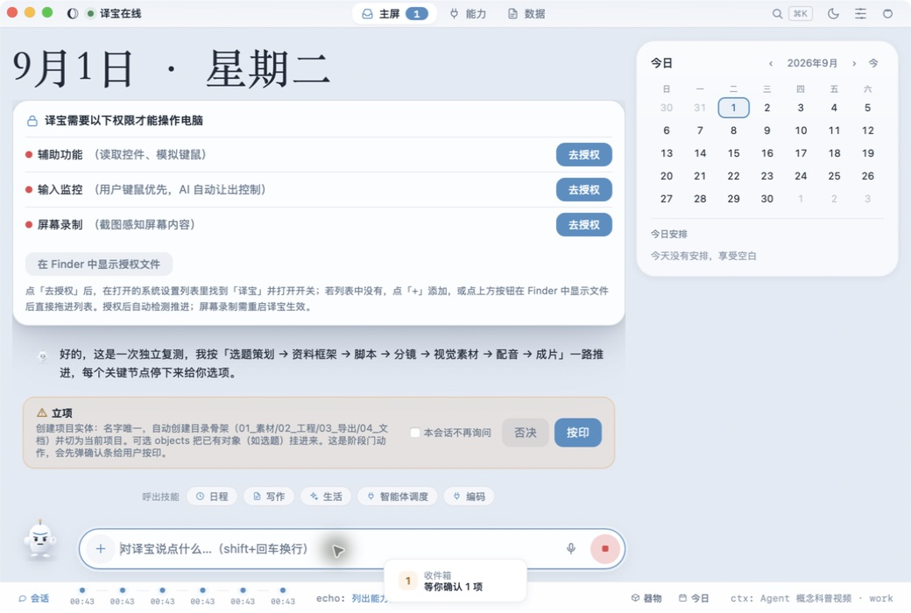
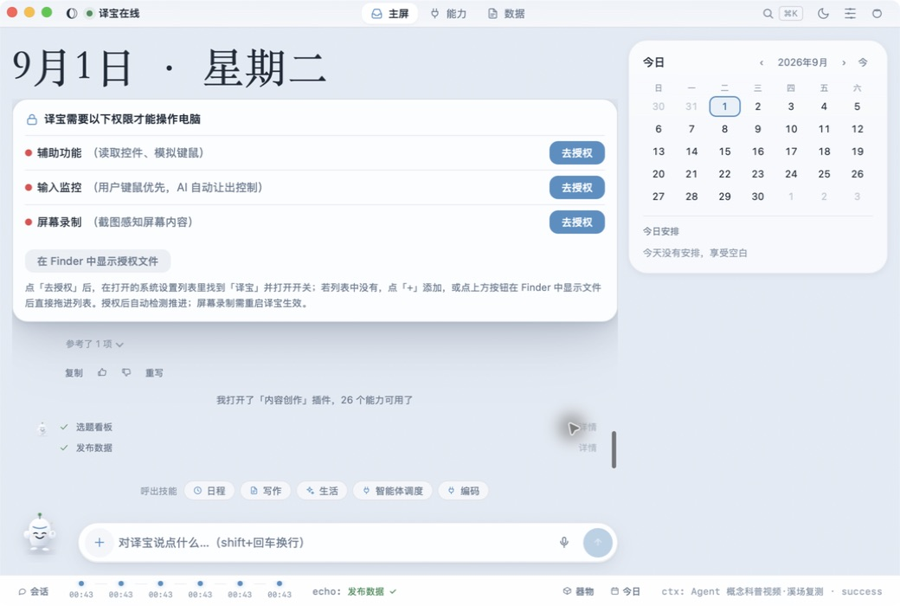
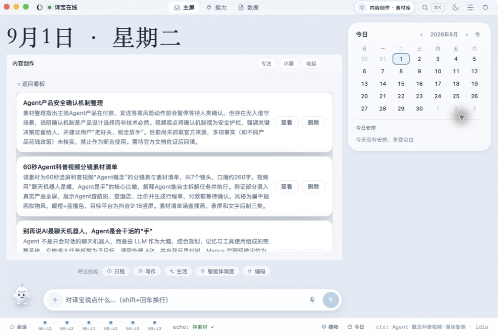
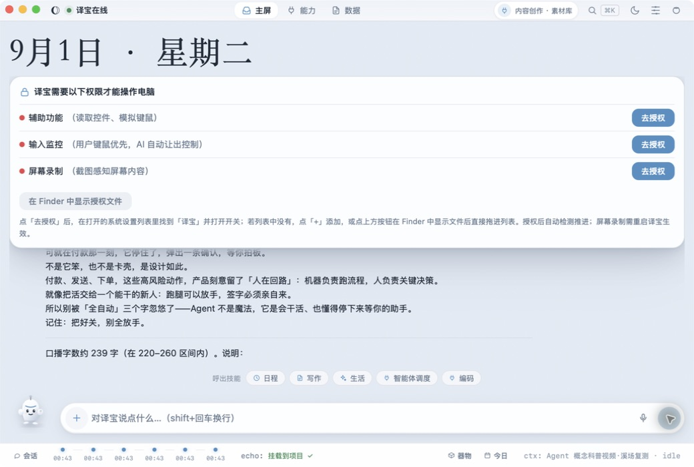
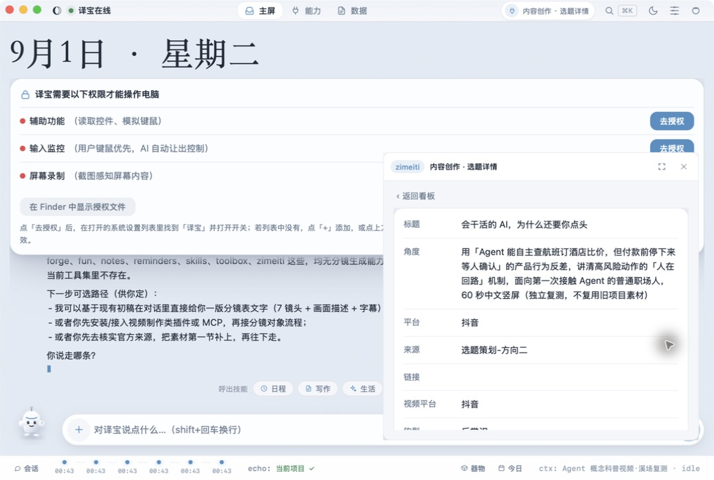
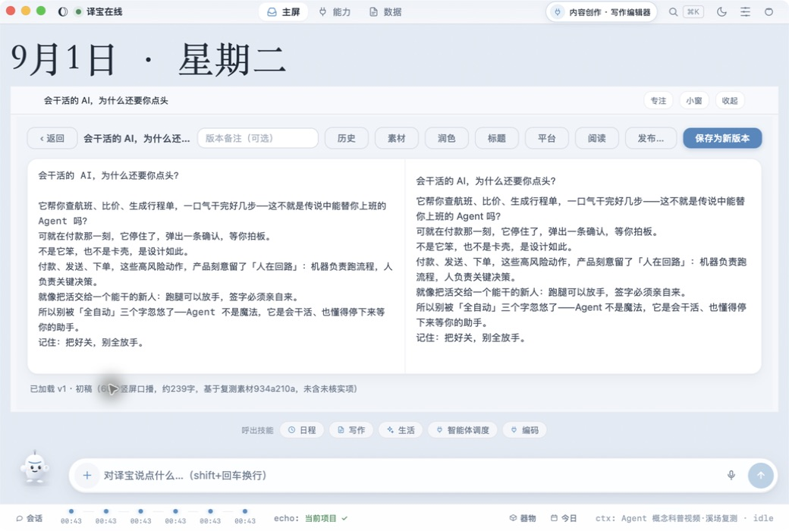
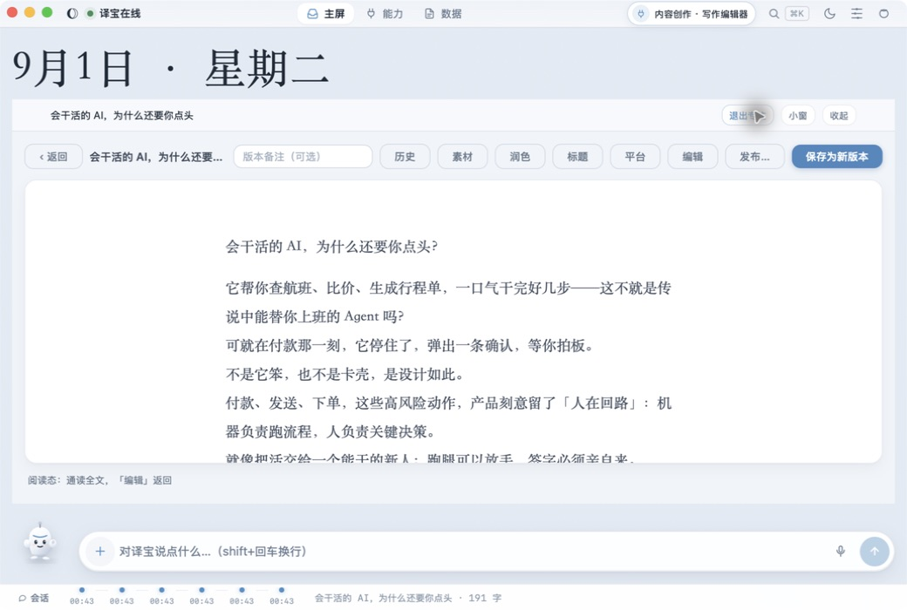
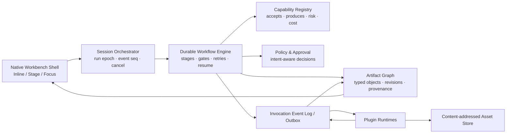

# 溪场模式复测：Agent 概念科普视频全流程产品审计

> 日期：2026-09-01
> 环境：macOS 原生译宝应用，主屏选择「溪场」preset，窗口 1040 × 700
> Case：面向第一次接触 Agent 的普通职场人，制作 60 秒中文竖屏「Agent 概念科普视频」
> 覆盖：新会话、立项、选题、研究、素材、脚本、Inline / Stage / Focus、项目关联、能力边界、真实落盘
> 证据边界：本报告只使用本轮 Mac 应用实操截图与本轮产生的数据；上一轮报告只作为历史文件保留，不作为本轮 UI 证据。
> 通用化方案：本报告的问题已进一步收敛为[Agent OS 通用工作语境、业务对象本体与能力表面架构](../design/2026-09-01-agent-os-generalized-architecture.md)，并用 PPT、编码、数据分析做了压力测试。

## 一、结论

溪场已经从“三栏管理台”迈向了更像陪伴式 Agent OS 的形态：会话退成按需抽屉、工作面可从对象长出、Stage → Focus → Esc 回退成立，写作编辑器在 Focus 中能自动进入阅读态。这部分方向是对的，而且比旧模式更接近“能力原生长在工作台里”。

但当前仍不能称为可扩展的 Agent OS。问题不在于少一个视频插件，而在于系统只有“对话 + 工具调用 + 插件面板”，没有稳定的任务、工作流、产物图谱和运行状态模型。实际流程在脚本 v1 后停止：项目只挂了一条 `zimeiti.topic`，脚本只是该选题下的一版 Markdown；系统没有 `script / storyboard / asset / voice / timeline / render` 等一等对象，也没有能力预检、阶段状态机和跨插件事务。因此用户看到的是一段看起来会推进的对话，而不是一个可以恢复、扩展、替换工具和交付结果的原生 Agent 工作台。

当前综合判断：**方向成立，核心运行与本体底座尚未成立。**

| 维度 | 评分 | 判断 |
|---|---:|---|
| Agent OS 定位 | 5.5 / 10 | 有原生工作面的雏形，但任务仍附着在聊天与全局插件数据上 |
| 产品逻辑 | 4.5 / 10 | 能立项、确认、落脚本；阶段乱序、作用域和完成语义仍不可靠 |
| 视觉形态 | 6.5 / 10 | 溪场更轻、更有陪伴感；权限卡、日期和通用表格仍抢占主任务 |
| 交互与视效 | 6 / 10 | Stage / Focus / Esc 很好；自动 Peek、TTS 与打断语义破坏控制感 |
| 业务 / 领域建模 | 3.5 / 10 | Project 只是引用集合；没有工作流实例、交付物与证据关系 |
| 系统架构 | 4.5 / 10 | 插件和表面层可扩展；跨存储一致性、运行隔离和耐久状态不足 |
| 可访问性 | 5 / 10 | AX 名称大体可读；窗口无标题、部分控件缺可见焦点、层级噪声大 |

## 二、本轮真实流程与健康度

| # | 操作 | 实际结果 | 健康度 |
|---:|---|---|---|
| 1 | 进入溪场，创建新会话 | 会话栏按需出现，是明显改进；但新会话继承旧的当前项目 | ⚠️ |
| 2 | 输入独立复测需求，明确不复用旧项目/素材 | 系统先弹立项闸门并创建新项目，顺序比上一轮正确 | ✅ |
| 3 | 等待 2–3 个选题选项 | UI 先显示“已完成 / idle”，选项稍后才出现；需再发“继续” | ❌ |
| 4 | 选择方向二 | 选项是纯文本，不是可追踪的 Inline 选择器；候选依据仍引用旧库 | ⚠️ |
| 5 | 研究官方来源 | 读到过官方页面，但中断后的下一轮无法继续使用这些证据，并反称“没有读到” | ❌ |
| 6 | 拒绝一次联网搜索审批 | 被拒的单次调用与“停止整个搜索阶段”没有区分；旧运行仍继续尝试其他调用 | ❌ |
| 7 | 保存研究素材并要求不打开面板 | 素材成功落盘，但未关联项目/选题；系统仍自动打开错误的旧选题 Peek | ❌ |
| 8 | 展开素材库 Stage / Focus | 三态切换和 Esc 回退成立；数据仍是全局素材混排 | ⚠️ |
| 9 | 创建方向二选题并挂项目 | 成功创建 `zimeiti.topic` 并挂入当前项目 | ✅ |
| 10 | 生成脚本，保存前预览确认 | 给出完整脚本与确认点，确认门成立 | ✅ |
| 11 | 保存脚本 v1 | Markdown 与 articles 记录真实落盘；随后又自动打开 Peek | ⚠️ |
| 12 | 检查项目与下一步分镜 | 项目只有 topic；脚本不是独立项目对象；无分镜/视频能力，流程终止 | ❌ |
| 13 | 打开编辑器 Stage，再进入 Focus | 编辑器原生嵌入工作面；Focus 自动切阅读态；Esc 可逐级退出 | ✅ |

### 关键证据

项目创建闸门在流程开头出现，这是本轮最重要的正向变化：



但立项后过早显示成功，选题候选尚未真正交付：



素材 Stage 虽然形态成立，但内容是跨项目全局混排：



脚本预览和保存前确认做对了：



脚本保存后，系统诚实暴露了能力边界，但也再次违背“不打开面板”自动弹出 Peek：



写作编辑器进入 Stage 后已很接近“工作台原生长出工具”：



Focus 会把同一器切为阅读态，是本轮最成熟的一段交互：



## 三、新问题列表

### P0：不解决就无法形成可信主链路

| ID | 问题 | 本轮证据 / 根因 | 影响 |
|---|---|---|---|
| P0-01 | **视频工作流在脚本后断裂** | 真实落盘只有 `Project → zimeiti.topic → articles/v1.md`；能力台账没有分镜、资产、配音、时间线和渲染工具 | “做视频”最终只是“写了一篇稿”，无法交付目标 |
| P0-02 | **运行状态不是单一真相** | 界面多次在工具仍执行时显示 `idle` 或“已完成”；迟到回复插到后续指令前；新输入会抢占旧 run | 用户不知道现在能否安全继续，也无法相信完成态 |
| P0-03 | **中断会造成证据失忆** | 同一对话先显示成功读取官方来源；下一轮却称没有读取任何官方文档。代码只在整轮正常结束时写入 tool 轨迹，中断直接 return | 事实链断裂，Agent 会对刚做过的研究自相矛盾 |
| P0-04 | **项目作用域没有成为数据边界** | 会话按 `conversation_id` 分桶，但项目取自全局 `current_project_id`；新会话因此继承旧项目。明确“不复用旧素材”仍读取旧内容，素材 Stage 也展示全库 | 私有项目串线、错误引用、团队场景下可能造成严重数据污染 |
| P0-05 | **能力预检太晚** | 先立项、研究、写稿，最后才发现系统没有分镜/视频能力 | 规划不可执行，用户在流程末端才知道无法交付 |
| P0-06 | **风险分类按关键词误伤只读研究** | `web_search` 是 L1，但查询包含 `payment / send / email` 等词会被通用危险关键词升到 L3 | 搜“支付安全”反而要审批，风险模型把“谈论危险”当成“执行危险” |

### P1：决定是否真的像 Agent OS

| ID | 问题 | 本轮证据 / 根因 | 影响 |
|---|---|---|---|
| P1-01 | **Project 只是引用袋，不是工作流实例** | `projects.json` 仅有名字、目录和 `{type, ref}` 列表；阶段由 type 字符串猜测 | 无法表达阶段、依赖、阻塞、完成标准、负责人和可恢复执行 |
| P1-02 | **跨域关系需要模型手工双写** | project 已挂 topic，但 `topics.project_id` 仍为空；测试里的标准流程要求 `project.create/attach` 后再 `zimeiti.update` | 两份真相会漂移，查询方向不同会得到不同答案 |
| P1-03 | **素材成为孤儿** | 新素材 `934a210a` 的 `topic_id` 为空，项目对象里也没有 material；脚本 note 只是把素材 id 写成文本 | 依赖不可追踪，后续无法判断脚本依据、来源状态和可复用范围 |
| P1-04 | **产品定义的“三态”与代码“四态”冲突** | 用户目标是 Inline / Stage / Focus；当前协议是 Inline / Peek / Stage / Focus，Stage 的“小窗”又回到 Peek | 状态机、文案与插件适配会越来越复杂；用户难预测“打开/摊开/小窗” |
| P1-05 | **表面裁决违反用户显式控制** | 两次明确要求“不打开面板”，仍因 tool 返回 panel 自动打开 Peek；其中一次还显示错误旧对象 | “不抢焦点”这一 Agent OS 核心承诺没有成为硬规则 |
| P1-06 | **文本对话默认全量 TTS** | sidecar 只要 voice 可用，每个 `final_reply_chunk` 都进入 TTS；“不要朗读”只是给模型看的文本，系统不识别 | 长回答持续占用 `say`，停止播报会同时标记逻辑 run 为“已打断” |
| P1-07 | **审批卡只解释工具，不解释任务意图** | 立项卡展示通用 tool description；没有本次项目名、拟创建对象、成本和后续阶段 | 用户是在批准 API，不是在批准可理解的任务变化 |
| P1-08 | **“字数”存在三套口径** | Agent 报约 239 字；详情页按 `len()` 显示 249 字；Focus 的规范计数显示 191 字 | 约束验收不可信，后续配音时长与平台限制会漂移 |
| P1-09 | **真实窗口宽度下项目卡消失** | 溪场 <1280px 进入 narrow，器物架收起；1040px 窗口只剩底部 tiny `ctx` | 当前任务、阶段、阻塞和产物无法成为视觉中心 |
| P1-10 | **选题确认仍是聊天文本** | 2–3 个方向没有 Inline 选择卡、选中状态、回退和差异字段 | 关键决策不可操作、不可审计，也不能自然升级到 Stage |

### P2：形态、视觉与可访问性

| ID | 问题 | 影响与建议 |
|---|---|---|
| P2-01 | **权限卡长期占据首屏** | 三项未授权会占去约三分之一高度；应改成低干扰状态条，只有能力真正需要权限时再就地升级 |
| P2-02 | **日期大字比任务更像主标题** | 溪场的氛围成立，但在工作中“9月1日”比项目/阶段更醒目；进入任务后应把日期退为环境背景 |
| P2-03 | **插件内部仍像嵌入式后台** | 素材库是长卡列表，详情是属性表；应由宿主提供原生 Artifact Shell，插件只交内容与动作 |
| P2-04 | **交互视效没有真正从调用锚点生长** | Peek 的动画起点是固定右下角矩形，不是实际调用行；应把 origin rect 作为表面协议的一部分 |
| P2-05 | **无障碍语义不完整** | App Window title 为空；部分 `.act` / Peek 图标按钮没有 `:focus-visible`；主内容与淡灰状态的对比偏弱 |

## 四、业务建模与本体论问题

### 4.1 当前隐含模型

```text
Conversation（最近 10 轮）
    └─ LLM 自由决定调用 Tool
          ├─ Project：JSON 里的引用集合
          ├─ Plugin DB：topic / article / material
          └─ Panel：最近一次插件数据快照
```

这个模型适合“聊天时顺便调工具”，不适合 Agent OS。它缺少三个核心本体：

1. **任务实例**：目标、计划、当前阶段、阻塞、预算、验收条件；
2. **产物图谱**：每个产物是什么、从什么推导、由谁创建、版本和审核状态；
3. **能力合同**：工具能接收/产出哪些对象，成本、风险、是否可取消、可用在哪个表面。

### 4.2 Workspace 与 Session 必须拆开

上一版把 `WorkspaceSession` 写成一等实体是不正确的：它会把持久的数据边界和短期的对话连续性重新揉成一个万能桶。

- `Workspace`：持久工作与治理边界，拥有成员、权限、能力策略、预算、Artifact Graph 和文件根；
- `Session`：对话与注意力连续性，拥有消息、输入草稿和 Run；
- `SessionContext`：两者的显式关联读模型，保存当前 Mission / Artifact / Revision 与 `run_epoch`，但不拥有业务数据；
- 一个 Workspace 可有多个 Session；一个 Session 同一时刻最多绑定一个 Workspace，也允许无 Workspace；
- 切换 Workspace 必须产生可见、可审计的 `SessionScopeChanged`，不能从全局 `current_project_id` 静默继承。

### 4.3 建议的一等实体

| 实体 | 必要字段 | 在视频 Case 中的例子 |
|---|---|---|
| `Workspace` | members、policies、artifact_graph、roots、budget | “Agent 概念视频”工作语境 |
| `Session` | messages、summary、draft、created_at | 本次溪场对话 |
| `SessionContext` | session_id、workspace_id、mission_id、active_artifact_id、run_epoch | 本会话显式绑定当前视频 Mission 与脚本 |
| `Mission` | goal、audience、constraints、definition_of_done、budget | 60 秒、中文、竖屏、普通职场人、需成片 |
| `WorkflowRun` | definition_ref、stage_instances、status、blocked_reason | topic → research → script → storyboard → render |
| `Artifact` / `Revision` | type、schema_version、lifecycle、head_revision、scope | `script.narration` 的 v1 revision |
| `Evidence` | source、claim、locator、verified_at、confidence | 官方文档对人工确认机制的证据 |
| `Capability` | accepts、produces、effects、risk、cost、cancel、resume | `storyboard.generate` 接 script，产 storyboard |
| `Invocation` | run_id、tool_id、input_refs、output_refs、state、event_seq | 某次保存稿件或生成分镜 |
| `Approval` | subject、revision、decision、scope、expires_at、actor | 批准立项、批准脚本 v1 |
| `Deliverable` | artifact_ref、acceptance_report、export_uri | 最终 1080×1920 MP4 |

### 4.4 产物类型与关系

建议至少定义这些类型，而不是把它们都塞进 `topic`：

```text
topic.brief
  └─ research.claim[]
       └─ script.narration
            └─ storyboard.scene[]
                 ├─ asset.visual[]
                 ├─ asset.audio[]
                 └─ voice.track
                      └─ timeline.composition
                           └─ video.render
```

关系必须是显式边：`contains`、`derived_from`、`supports`、`uses`、`supersedes`、`approved_by`、`rendered_from`。项目只聚合根节点，其他依赖由图谱推导，不再靠 note 文本里的素材 id。

### 4.5 三态应该是呈现态，不是业务态

保留用户定义的三种语义：

| 呈现态 | 语义 | 允许行为 |
|---|---|---|
| Inline | 对话流中的选择、回执、进度、轻审批 | 不遮挡，不改变 active artifact |
| Stage | 围绕当前 artifact 的生产工作面 | 共享输入、上下文、版本与动作 |
| Focus | 同一 Stage 的沉浸模式 | 不换对象，只减少环境噪声 |

当前 Peek 建议降为 **Stage 的瞬态 compact presentation**，不进入插件公共状态枚举。这样插件只适配三态；宿主可自行决定用气泡/小窗承接轻量预览。

## 五、系统架构问题与目标架构

### 5.1 当前架构的具体风险

- `projects.json` 每次整本原子替换，只有进程内锁；适合单机小数据，不适合多进程插件、跨设备同步和查询。
- 项目、插件 SQLite、Markdown 文件、conversation history 是多个独立写点，没有事务或 outbox。
- `Project.attach` 与插件的 `project_id` 回写是两次工具调用，失败一半就产生漂移；本轮已经出现。
- 对话历史只在正常最终回复时持久化整轮 tool 轨迹；被打断的研究过程不进入下轮模型上下文。
- 同会话新请求会抢占旧任务，但旧任务有最多 8 秒收尾宽限；前端没有按 `run_epoch / event_seq` 丢弃迟到事件。
- surface 域只保存最近场景/最近面板；活动轨仅内存 12 条，不足以成为可恢复的任务日志。
- 项目阶段由对象 type 名字中是否含 `script/doc` 推导；本轮文章是 `articles` 子记录，项目仍只能判断为 S0。

### 5.2 建议的分层



关键原则：

1. **Workspace / Session 正交**：SessionContext 只显式绑定当前 Workspace / Mission / Artifact；所有 list/search/open 自动注入 `workspace_id`，插件不能默认返回全库，用户显式切“全局”才放宽。
2. **运行代数**：事件必须带 `conversation_id + run_epoch + invocation_id + seq`；客户端只接受当前 epoch，迟到事件进审计日志但不改 UI。
3. **部分检查点**：每个 tool result 立即写 Invocation Log；中断只改变运行状态，不抹掉已取得的证据。
4. **跨域一致性**：ArtifactGraph 成为关系权威；插件域通过 transactional outbox 发布 `ArtifactCreated/Updated`，不再双写 project_id。
5. **能力预检**：Workflow 启动前计算全链路是否可满足，明确缺失插件、预计成本和降级路径，再让用户立项。
6. **媒体任务异步化**：视觉生成、配音、渲染跑 durable job；Stage 显示可恢复进度，关闭窗口不丢任务。

## 六、产品逻辑与交互建议

### 6.1 理想的 Case 流程

1. 用户输入“做一个 Agent 概念科普视频”。
2. Inline 先出现 **任务理解卡**：受众、时长、比例、交付物、缺失项。
3. 系统做能力预检：能完成到哪一步、缺哪些插件、是否允许纯文本降级、预计时间/成本。
4. 用户确认后在 Workspace 内创建 `Mission + WorkflowRun`，一次事务落盘；用户看到的“项目卡”是其读模型，不再新增万能 Project 容器。
5. Inline 显示 3 个结构化选题卡；选择后生成 `topic.brief`，不是一段聊天文本。
6. Stage 打开当前 topic，研究证据以 claim/source 结构进入右侧或器物区；不显示全局库。
7. 脚本预览作为 `script.narration.draft`；用户确认后变成 revision v1 并推进 stage。
8. Storyboard 能力缺失时，系统在第 3 步就阻塞；安装/替换能力后从 stage 继续，不重做研究和脚本。
9. Focus 只是同一 artifact 的沉浸态；Esc 逐级恢复，不丢草稿、选区、滚动和任务位置。
10. 最终 `video.render` 满足 acceptance 后，Mission 才显示完成。

### 6.2 视觉层级

- 家态：保留大日期和今日轴，体现陪伴感。
- 任务启动：日期降到环境背景；项目名 + 当前阶段 + 阻塞成为主标题。
- Inline：优先显示“要你做什么”，工具名退到二级详情。
- Stage：宿主绘制统一 Artifact Shell（面包屑、版本、证据、状态、输入条）；插件只渲染器内容。
- Focus：保留当前对象、版本、保存状态和退出路径；隐藏日历、权限卡、快捷技能。
- 权限：只在需要相应能力时就地出现一次，平时地平线显示小红点，不常驻大卡。

### 6.3 动效规则

- Inline → Stage 必须从实际卡片的 origin rect 生长，220–280ms；不是从固定右下角出现。
- Stage → Focus 只改变空间与信息密度，不重建插件 iframe，不闪白、不丢滚动。
- 运行状态只允许单向可解释转换：`queued → running → waiting_user / blocked → done / failed / cancelled`。
- `cancelled` 与 `speech_stopped` 必须拆开；停止声音不能污染任务结果。
- 迟到事件以“旧运行已收尾”静默记账，不重新插入当前对话。

## 七、业务可扩展性建议

当前插件是“有什么工具就调用什么”，难以形成稳定业务。更适合产品化的是 **Workflow Pack**：

```yaml
id: video.explainer.60s
inputs: [audience, duration, aspect_ratio, topic]
outputs: [video.render]
stages:
  - topic.select
  - research.verify
  - script.write
  - storyboard.build
  - asset.prepare
  - voice.generate
  - timeline.compose
  - video.render
acceptance:
  duration_seconds: [55, 65]
  aspect_ratio: "9:16"
  unresolved_claims: 0
```

插件声明自己覆盖哪些 stage 以及接受/产出的 Artifact 类型。这样：

- 能替换供应商而不改变工作流；
- 能在立项前报价和估时；
- 能把高质量渲染、品牌模板、团队审核、并发任务做成付费能力；
- 能用“完成一个可验收工作流”而不是“安装一个插件”作为价值与计费单位。

### 7.1 不是只为视频：跨领域压力测试

视频流程不能成为 OS 内核。相同模型至少必须覆盖：

| 领域 | Artifact 链 | Stage 主器物 | Focus | 验收 |
|---|---|---|---|---|
| 视频 | brief → claims → script → storyboard → timeline → render | 分镜 / 时间线 | 单镜头、脚本阅读、成片预览 | 时长、比例、证据、音画、可播放 |
| PPT | brief → claims → storyline → slide specs → deck → pptx | 缩略图 + 画布 + 证据 / 备注 | 单页编辑、叙事排练、放映 | 字体、溢出、来源覆盖、可打开导出 |
| 编码 | issue → repo snapshot → plan → patch → test evidence → build | 代码 + 终端 + diff + 测试 | 文件编辑、diff review | test、lint、安全、构建边界 |
| 数据分析 | question → data snapshot → quality → metrics → query → chart → report | 数据探查 + notebook + 图表 | 查询审查、图表 / 报告精读 | 新鲜度、质量、可复现、口径 |

Inline / Stage / Focus 在四个领域里保持相同语义，但 Instrument Canvas、Artifact schema、WorkflowDefinition 和 acceptance 由领域包提供。完整合同、对象基数、响应式规则与迁移路径见[通用架构规格](../design/2026-09-01-agent-os-generalized-architecture.md)。

## 八、优先级建议

### P0：先修可信运行内核

1. 引入 `run_epoch + event_seq`，前端丢弃迟到事件；统一 `busy / idle / done` 真相。
2. tool result 即时持久化；中断轮保留 partial transcript 与 Evidence。
3. `speech_stop` 与 `run_cancel` 分离；文本输入默认不 TTS，语音会话或显式朗读才播。
4. 风险分类改为 `tool capability + effect schema`，禁止对 read-only query 文本做危险关键词升级。
5. 拆分 Workspace / Session；用 per-session `SessionContext` 取代全局 `current_project_id`，Host 层强制 Workspace 过滤。

### P1：补齐通用本体，并用视频 + PPT 双域验证

1. Workspace、Session、SessionContext、Mission、ArtifactGraph 与 WorkflowRun。
2. 把 topic、material、script 都升级为独立 Artifact；迁移现有 article/material 关系。
3. 增加视频 schema，同时增加 `deck.storyline / deck.slide_spec / deck.document / deck.export.pptx`，验证内核不依赖视频阶段。
4. 做可用的视频与 PPT Workflow Pack；缺能力时在立项前阻塞，provider 可替换后从 checkpoint 继续。
5. 三态收敛为 Inline / Stage / Focus；Peek 仅作为宿主瞬态。

### P2：完成溪场的产品气质

1. 项目/任务状态在 1040px 也必须可见。
2. 权限卡降级为按需提示。
3. 结构化候选卡、意图型审批卡、原生 Artifact Shell。
4. 修空窗口标题、focus ring、对比度与 Reduced Motion 验收。

## 九、验收标准

下一轮不应只验“看起来完成”，而应满足以下可证条件：

- 新会话可以选择“继承当前项目 / 新任务 / 无项目”，默认不隐式串线。
- 明确“不复用旧素材”时，所有工具查询均带项目 scope，结果中零旧项目对象。
- 任意时刻 UI 的状态与最新 WorkflowRun 状态一致；旧 run 的迟到事件不能改当前 UI。
- 中断研究后，新一轮仍能列出已成功抓取的 source 与未完成项。
- 停止 TTS 不产生“已打断”任务结果。
- 用户说“不打开面板”时，任何 tool panel 都只能生成 Inline receipt / activity，不得 Peek。
- 项目中能查询到 topic、evidence、material、script、storyboard、assets、voice、timeline、render 的显式关系。
- 从任一 Stage 关闭应用再打开，可恢复当前 artifact、版本、滚动、草稿、运行和待确认项。
- 60 秒视频最终产生真实 MP4，且时长、比例、未核实断言、版本来源均可验收。

## 十、做得好的部分

- 溪场把会话从常驻左栏降为按需入口，陪伴感和空间呼吸明显更好。
- 立项闸门提前到流程开始，用户控制权比上一轮更强。
- 脚本保存前给完整预览并等待确认，符合高价值产物的控制预期。
- Topic → Stage 的对象标题正确，编辑器共享底部输入条，没有跳到独立应用。
- Stage → Focus 自动触发同一编辑器的阅读态，Esc 可逐级回退；这是“插件从工作台长出来”的最佳样例。
- 能力缺失时 Agent 最终没有伪装成已生成分镜或成片，完成边界是诚实的。

## 十一、证据限制

- 本轮没有进入真实视觉生成、配音、时间线与渲染，因为当前能力注册表不提供这些对象/工具；这本身是主结论的一部分。
- 没有修改产品代码；本轮新增审计报告、截图证据与通用架构规格。
- 没有把 unit/build test 当成 GUI 行为证明；本报告中的交互结论均来自 Mac 应用本轮操作。

## 十二、本轮产生的测试数据

- Project：`proj_3c8c47add60a`（Agent 概念科普视频·溪场复测）
- Topic：`7deb1ae93f8e48899174c9a9535b79a0`（会干活的 AI，为什么还要你点头）
- Material：`934a210a744d4e66b2b1447e22d5e1a9`（Agent产品安全确认机制整理）
- Article：topic 下的 v1，文件 `articles/7deb1ae93f8e48899174c9a9535b79a0/v1.md`

这些数据保留在译宝本地数据目录中，便于你直接在当前项目继续检查；本轮未执行删除或清理。
