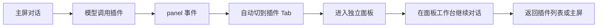
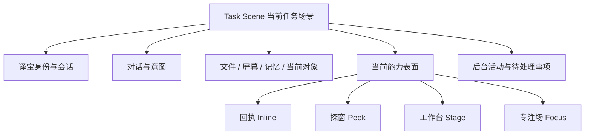
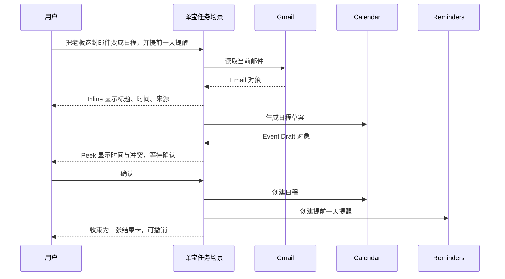
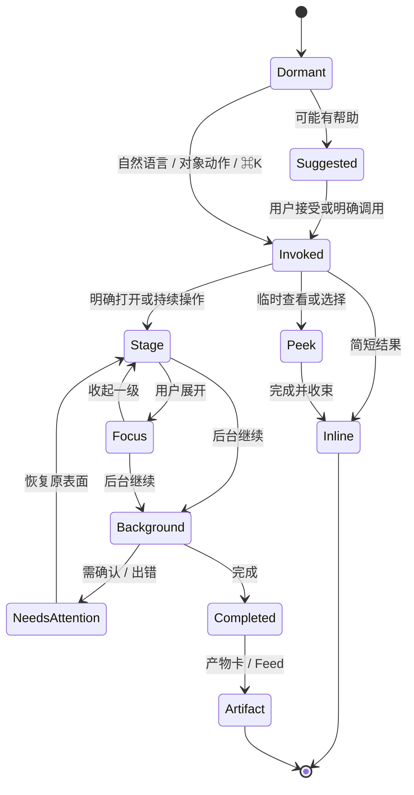

# 能力不是页面：译宝插件 / 应用的 OS 化调用模型

日期：2026-08-09  
状态：方向已确认；独立交互原型 v2 已通过；主屏生产接入已实现并完成核心验收  
范围：译宝大窗主屏内的插件、外部应用与复杂工作台调用；不改变现有 L0–L4 风险闸门

原型入口：`desktop/capability-surface.html`。v2 已验证“主屏内展开选题工作面、对象进入同一输入框作用域、对话与能力活动混合记录、刷新后恢复、收起后状态可恢复”。当前持久化使用版本化 `localStorage` 快照，只是交互验证；生产版必须接任务级持久化服务，不能把用户真实对话长期散落在 WebView 本地存储中。

生产入口：`desktop/home.html`。主屏现在将真实 `panel` 事件收束为任务级能力活动：模型触发只产生关联卡与活动胶囊，不自动抢页；插件库中的用户明确点击直接进入 Stage。Stage 复用现有 `SchemaPanel` / `WebviewPanel`、风险闸门、`panel_action` 与焦点上报，不复制插件运行时。协作轨通过只读 Tauri 命令投影 sidecar 的 `history.json`，刷新仅恢复 UI，不重放工具；原始工具参数不会透给渲染层。`localStorage` 只保留 panel ref、展开态和 Stage / Focus 布局偏好，不保存真实对话正文。

## 0. 最终建议

译宝不应该把插件和应用继续当成“要跳进去的页面”，而应该把它们变成**当前任务临时长出来的能力表面**。

推荐采用：

> **一个稳定场景 + 四级能力表面 + 一条活动轨。**

- **一个稳定场景**：用户始终留在当前会话 / 当前任务里。左侧会话、译宝身份、主输入框和返回路径不消失。
- **四级能力表面**：回执、探窗、工作台、专注场。复杂度逐级增加，但都属于当前任务，不成为新的信息架构页面。
- **一条活动轨**：运行中、等待批准、已完成的插件活动统一缩在活动轨里；用户可随时展开、切回、终止。

一句更直白的话：

> **插件是能力，不是目的地；应用是协作者，不是新房间；任务才拥有屏幕。**

这会比“聊天页 → 插件页 → 面板 → 返回聊天页”的结构更接近现代 OS：能力在需要时进入当前上下文，结束后退回背景，而不是让用户替系统管理页面。

---

## 1. 当前体验为什么有“跳页面感”

现有底座其实已经具备正确方向：统一 ToolInvoker、统一风险闸门、面板焦点上报、工作台输入条、任务收件箱、Feed 和插件 schema / webview 宿主。问题主要出在**表面组织方式**。

当前链路大致是：



断裂感来自六件事：

1. **空间突变**：`panel` 事件会把顶层 `tab` 切到插件页，主屏结构整块消失。
2. **入口与结果分离**：用户在对话里提出意图，结果却在另一个页面出现。
3. **对话被复制**：主屏有输入条，面板里又有一套工作台条，像从一个助手切到另一个助手。
4. **插件身份压过任务**：界面告诉用户“你去了某插件”，而不是“这件事正在使用某能力”。
5. **返回路径是导航，不是收起**：用户必须想“回主屏”，而不是自然地结束一次局部操作。
6. **所有面板近似同级**：查一条信息、挑三个结果、编辑长文和跑 Coding，都会倾向于打开一个完整面板。

真正需要改变的不是圆角、动效或插件页布局，而是宿主的基本单位：从 `Page` 改成 `Task Scene + Surface`。

---

## 2. 核心空间模型：任务场景（Task Scene）

主屏不再被理解成“聊天页”，而是一个持续存在的任务场景：



这个模型有三个硬规则：

### 2.1 译宝是唯一持续身份

插件里不再出现第二套“助手人格”。无论正在使用日历、Notion、Coding 还是自媒体插件，用户仍然在和译宝协作。

应用只提供：

- 数据来源
- 确定性动作
- 专业交互表面
- 品牌与溯源信息

应用名应该是“这一步用了谁”的署名，而不是顶层目的地。

### 2.2 当前任务拥有屏幕

能力表面必须附着于当前任务。它可以变大，但不能无缘无故替换任务：

- 会话不丢
- 输入草稿不丢
- 滚动位置不丢
- 当前对象不丢
- 退出后回到原位置

### 2.3 插件不能自行抢占焦点

插件可以声明自己支持哪些表面，但最终展示级别由译宝宿主根据用户意图、内容密度和风险决定。

模型或插件**最多自动展开到“探窗”**。进入“工作台 / 专注场”需要：

- 用户明确说“打开、看看、编辑、继续做”；或
- 用户点击结果卡、能力入口、展开按钮。

这条规则会直接消除“结果一回来就跳页”的根因。

---

## 3. 四级能力表面

### 3.1 回执 Inline：事情做完，结果留在原地

适合：查询、创建成功、保存、简短预览、少量选择。

形态：能力调用过程行在原位置收束成一张宿主原生卡，而不是只留一句“正在和某插件协作”。

示例：

- `日历 · 已创建「周一复盘」 10:00–10:30`
- `素材库 · 已保存《AI Native 产品的交互边界》`
- `Gmail · 找到 3 封相关邮件`，卡内直接显示 3 条摘要

卡片只保留一到两个最相关动作，例如“撤销”“展开”。卡内可以带应用图标，但视觉骨架、间距、按钮、风险提示全部由译宝宿主控制。

**默认原则：能在回执里完成，就不要打开面板。**

### 3.2 探窗 Peek：看一眼、选一下、马上走

适合：临时查看 5–10 条结果、挑选对象、设置一个简单参数、首次连接应用。

形态：从调用入口做 matched-geometry 展开，成为附着在结果卡、能力 chip 或右侧关联能力上的轻浮层；关闭时缩回原锚点。

关键特征：

- 不重排整个主屏
- 不占有独立导航历史
- `Esc`、点击空白或完成动作后自然收起
- 用户仍能看见背后的对话与任务
- 首次授权在这里完成，授权后原地继续

探窗不是传统 modal。它必须明确“从哪里长出来”，这样用户不需要重新建立空间记忆。

### 3.3 工作台 Stage：能力获得主舞台，任务仍然在场

适合：看板、列表管理、日历挑时间、素材挑选、表单编辑、需要来回对话的工作。

形态：空间从“左栏 + 对话页 + 右栏”重排为三层，而不是再挤入一个侧面板：

- 64–72px 系统轨：译宝身份、上下文、待处理和收起入口。
- 288–320px 协作上下文轨：对话、能力调用、对象切换与结果按时间顺序混合展示。
- 剩余空间全部交给能力主舞台；在 1280px 窗口中通常可获得约 68%–72% 的任务内容宽度。

窄于 980px 时，协作上下文轨让出屏幕，能力主舞台完整接管；底部共享命令栏仍保留。上下文不是销毁，而是通过轨道入口或退出专注后恢复。

工作台顶部由宿主统一提供：

- 当前任务 / 能力名称 / 当前对象的 breadcrumb
- 应用来源与连接状态
- 收起、展开、更多操作
- 运行中 / 已保存 / 离线等状态

底部仍然只有**一条任务级共享命令栏**，横跨协作上下文与能力主舞台。输入框同时显示“对译宝”和当前对象作用域，例如：

`在看：自媒体 / 选题看板 /「AI OS」`

用户说“把这个移到写作中”，译宝直接理解“这个”，不需要面板再造一个聊天系统。

### 3.4 专注场 Focus：复杂工作变大，但译宝仍在场

适合：Coding、长文编辑、大型看板、复杂数据表、需要宽屏的专业应用。

形态：能力表面占据除系统轨之外的主内容区；协作上下文轨暂时隐藏，但共享命令栏保持可用。退出专注后，原时间线、筛选、对象和滚动状态恢复。

- 当前目标和当前对象始终显示在命令栏作用域中
- 运行、等待批准与失败状态在舞台或活动轨内持续可见
- `Esc` 逐级执行“清除当前对象 → 退出专注 → 收起工作面”
- 隐藏的协作上下文必须同时退出可访问性树，避免键盘焦点落入不可见区域

这不是“切去 Coding 插件页”，而是“当前任务进入 Coding 专注布局”。顶层壳、会话身份、活动轨、风险闸门都不变。

窄窗口下不强行挤压：工作台改为 overlay；专注场覆盖主内容区，但保留一个可一键呼回的伙伴胶囊。

---

## 4. 背景活动不是第五个页面

耗时任务离开当前视线后，进入统一活动轨（Activity Shelf），而不是留一个打不开的插件窗口。

活动轨位于顶栏右侧或右侧上下文轨顶部，常态只显示最重要的三类状态：

- `Coding · 正在改 4 个文件`
- `日历 · 等你确认 1 项`
- `自媒体 · 文章已生成`

点击胶囊恢复它上次的表面、滚动位置与对象焦点。完成后胶囊停留一个合适的短周期，然后收束为 Feed / 本次产出。

Apple 的 Live Activities 也把这种模式定义为：短中期任务用小而可见的状态持续更新，点按直达相关细节，并只为关键更新提醒用户；2025 年底的指南已把 Mac 菜单栏列为承载位置之一。译宝不必照搬视觉，但应照搬“**环境态 → 相关细节，而不是通知 → 首页**”的结构。[Apple Live Activities](https://developer.apple.com/design/human-interface-guidelines/live-activities)

活动轨必须服从现有用户优先原则：用户正在操作时，活动只改变状态，不抢键盘焦点、不自动展开、不用补偿点击。

---

## 5. 调用决策：不要先问“打开哪个插件”

宿主先判断用户要完成什么，再决定是否需要表面。

| 用户意图 | 默认处理 | 表面 |
|---|---|---|
| “记一下这句话” | 直接执行，给可撤销回执 | Inline |
| “查一下下周哪天空” | 返回简短时间候选 | Inline |
| “看看下周日程” | 显示一周概览，可选日期 | Peek / Stage |
| “打开选题看板” | 用户明确请求视觉工作区 | Stage |
| “继续改这个项目” | 恢复上次 Coding 状态 | Focus |
| “后台跑完，完成告诉我” | 不开 UI，进入活动轨 | Background |
| 模型觉得某应用可能有帮助 | 只显示轻建议，不自动打开 | Suggested |

可以把决策抽象成三个问题：

1. **用户需要看吗？** 不需要就直接执行。
2. **用户需要选择吗？** 少量选择用 Inline / Peek。
3. **用户需要持续操纵吗？** 才进入 Stage / Focus。

这意味着 `ActionResult.panel` 不应再等价于“立刻打开面板”。它只表示“这个结果存在一个可视表面”；宿主还需要根据意图决定 `presentation` 和 `attention`。

---

## 6. 五种自然召唤方式，收敛成同一条链路

### 6.1 自然语言：按任务调用

用户说“把这封邮件安排到日历里”，不需要先指定 Gmail，再切 Calendar。译宝解析任务，能力在过程中露出来源和状态。

### 6.2 对象上的动作：就地调用

邮件、文件、日程、素材、文章都成为可引用的“对象卡”。选中对象后出现与对象相关的少量动作：

- 邮件 → 总结 / 建日程 / 设跟进
- 文件 → 阅读 / 改写 / 发送
- 选题 → 找素材 / 写大纲 / 开稿

这比“打开插件 → 找到对象 → 再操作”更像 OS。

### 6.3 ⌘K：从页面搜索升级为动词搜索

当前命令面板以页面和系统命令为主。建议变成：

- `在日历中安排…`
- `从 Gmail 查找…`
- `把选中内容存为素材`
- `继续 Coding：yibao`
- `打开能力库`

结果排序按“当前对象可执行动作 → 最近任务 → 常用能力 → 页面”组织，而不是先列主屏 / 插件 / 数据 / 设置。

### 6.4 右侧关联能力：上下文建议

右侧“关联能力”不再是跳转入口，而是可展开的能力锚点。点击后从该行长出 Peek / Stage；建议必须解释相关性，例如：

`日历 · 因为本次对话提到了下周二`

### 6.5 主动建议：只建议，不接管

模型可以说“要不要把这三项写进日历？”，并提供一个轻按钮。未点击前不能连接应用、不能打开表面、不能抢焦点。

---

## 7. 多应用协作：用对象接力，不用页面接力

最能体现 OS 化的不是单插件打开得多漂亮，而是多应用协作时用户仍然只感知一个任务。

示例：“把老板这封邮件变成日程，并在前一天提醒我。”



关键不是在 Gmail、Calendar、Reminders 三个页面之间跳转，而是让对象在同一个任务里接力：

- `Email`
- `EventDraft`
- `CalendarEvent`
- `Reminder`

每个对象带来源、权限、稳定 ID 和可执行动作。插件 / 应用返回**类型化对象与产物**，而不只是文本或一块不可理解的 HTML，译宝才能自然地跨应用编排。

Apple 的 App Intents 也是把应用动作与实体结构化后交给 Siri、Spotlight、Widgets、Controls 等系统表面，而不是要求用户先进入应用。[Apple App Intents](https://developer.apple.com/documentation/appintents)

OpenAI 2026 年的插件定义也已明确区分：插件可以把 skills、apps 与模板组合成一个工作流，单个插件可包含多个应用能力，目标是让用户完成工作而不必手工切换工具。这验证了“工作流在上、应用在下”的方向。[Plugins in ChatGPT and Codex](https://help.openai.com/en/articles/20001256-plugins-in-chatgpt-and-codex)

---

## 8. 权限与风险也要留在原地

自然不等于隐藏。第一次连接应用、共享敏感上下文、执行写操作时，必须让用户知道：

- 正在调用谁
- 会发送什么数据
- 要做什么动作
- 影响范围是什么
- 是仅本次允许，还是持续授权

推荐把确认放在动作发生的表面附近：

`将向 Calendar 发送：标题、时间、参与人（3 项）`

按钮：`仅这次` / `始终允许此类读取` / `取消`

高风险写入继续进入统一收件箱，但当前表面保留一个“等待你”的冻结状态。用户批准后原地恢复，不重新打开插件、不丢失编辑内容。

外部应用不能读取整段会话作为默认行为。宿主按最小必要原则打包明确的 context envelope；这与 OpenAI Apps 首次连接时明确数据共享、应用只收集必要信息的现行方向一致。[Apps in ChatGPT](https://openai.com/index/introducing-apps-in-chatgpt/)

---

## 9. 动效不是装饰，而是空间解释

OS 化的顺滑主要来自**可预测的空间变化**：

1. **从来源长出**：点击关联能力、结果卡或活动胶囊，表面从该元素展开。
2. **同源缩回**：收起时回到原锚点，不做无来源的淡出。
3. **先占位再加载**：100ms 内出现宿主骨架和能力名称；数据晚到只更新内容，不让窗口突然出现。
4. **布局用弹性，不用瞬移**：常规展开 180–240ms；对话区宽度同步变化，文本不突然重排两次。
5. **状态跨形态连续**：Inline → Stage → Focus 时，相同标题、对象与主要操作保持相对位置。
6. **键盘退场一致**：`Esc` 每次只退一级；`⌘W` 收起当前表面；再次调用恢复原状态。

不建议：飞入的大卡片、长时间 blur、全屏遮罩、插件自带窗口阴影、每个插件一套转场。这些会强化“第三方页面被塞进来”的感觉。

---

## 10. 宿主与应用的视觉分工

为了让插件“像译宝的一部分”，不是把所有应用都染成同一个颜色，而是统一**骨架**、保留**身份**。

宿主统一：

- 布局、标题栏、返回 / 收起 / 展开
- 字体、间距、圆角、focus ring
- loading、空态、错误、离线
- 选择、确认、撤销、完成
- 输入条、快捷键、可访问性
- 风险与权限提示

应用保留：

- 名称、图标、单一 accent
- 领域专属信息结构
- 必要的专业控件，如代码 diff、日历网格、画布
- 数据来源与溯源

应用 logo 是 provenance，不是另一个顶栏。第三方 webview 默认无自绘外框和第二套导航；译宝提供 chrome，应用只渲染内容。

---

## 11. 推荐生命周期



生命周期要和展示形态分离：后台运行不等于隐藏数据，等待批准不等于弹窗，完成也不等于关闭一切。

---

## 12. 对当前代码结构的建议映射

这部分只说明设计落点，不代表已经批准实施。

### 12.1 `Home.vue`

- 顶层不再因 `panel` 事件自动 `tab = "plugins"`。
- 日常顶栏最终移除“插件”一级页；能力库放进 ⌘K 和设置。浏览 / 安装能力是管理行为，不是每次工作的必经页。
- 新增一个常驻 `SurfaceHost`，属于当前 Task Scene。

### 12.2 `HomeChat.vue`

- 把“⇢ 正在和某面板协作 / 前往”改成 `SurfaceAnchor`：过程行可以原地收束为 Inline，或从这里展开 Peek / Stage。
- 对话不再通过 `open-panel` 跳顶层页面。
- 当前任务、输入草稿、滚动位置始终保留。

### 12.3 `HomeContextPanel.vue`

- 保留上下文、待批准、运行中、产物这些正确结构。
- “关联能力”成为表面锚点。
- 激活 Stage 时，右栏折叠成 Activity / Context Rail，SurfaceHost 从这里扩展。

### 12.4 `HomePlugins.vue`

拆成两部分：

- `CapabilityLibrary`：搜索、安装、连接、权限管理，低频入口。
- `CapabilitySurface`：复用现有 SchemaPanel / WebviewPanel 渲染，但不再拥有独立插件页和第二套工作台对话。

### 12.5 `PanelApp.vue`

浮窗继续作为小窗模式或跨窗口工作需要的宿主，但应与大窗共用同一个 `SurfaceSession` 与状态机。大窗 / 浮窗之间是“停靠 / 拆出”，不是打开两个副本。

### 12.6 `SchemaPanel.vue` / `WebviewPanel.vue`

继续作为内容 renderer。新增可响应表面尺寸的约定，并让宿主控制 chrome：

- `inline`
- `peek`
- `stage`
- `focus`

插件可声明支持范围、最小宽度、首选尺寸，但不能声明“自动抢焦点”。

### 12.7 协议

建议把现有 `panel` 语义演进为宿主可裁决的 surface descriptor：

```json
{
  "surface_id": "zimeiti:board:topic-42",
  "provider": "zimeiti",
  "title": "选题看板",
  "object": { "type": "topic", "id": "42", "title": "AI OS" },
  "presentation": "stage",
  "attention": "suggest",
  "origin": "conversation:message-108",
  "resumable": true
}
```

其中：

- `presentation` 是建议，不是命令。
- `attention = quiet | suggest | focus` 由宿主结合用户显式意图裁决。
- `origin` 用于 matched-geometry、返回与恢复焦点。
- `object` 让后续跨应用接力不依赖面板 DOM。
- `surface_id` 让大窗、浮窗、后台活动共享同一个实例状态。

### 12.8 任务时间线与恢复快照

生产版需要新增独立于模型短期上下文和 Feed 收件箱的 `TaskTimeline`。三者职责不能混用：

| 数据 | 作用 | 保存内容 |
|---|---|---|
| ConversationHistory | 给模型继续推理 | user / assistant / tool 调用轨迹，按轮裁剪 |
| TaskTimeline | 给用户追溯当前任务 | 对话摘要、能力调用、对象切换、批准、结果、失败、产物引用 |
| Feed / Inbox | 跨任务提醒用户 | 进行中、待批准、已完成和主动事件 |

建议的时间线事件最小结构：

```json
{
  "event_id": "evt-2048",
  "task_id": "task-ai-os-01",
  "kind": "capability_result",
  "provider": "zimeiti",
  "surface_id": "zimeiti:board:topic-42",
  "object": { "type": "topic", "id": "42", "title": "AI OS" },
  "action": "append_examples",
  "status": "done",
  "summary": "已找到 5 个案例并同步进当前选题",
  "detail_ref": "plugin://zimeiti/runs/run-88",
  "created_at": "2026-08-09T10:00:00+08:00"
}
```

硬约束：

- 时间线只保存用户可理解的摘要和引用，不复制完整敏感工具结果。
- 插件领域数据仍归插件自己的存储；时间线只记录“发生了什么”和可恢复引用。
- 恢复快照保存 `surface_id`、展示级别、当前对象、滚动、未提交草稿和筛选状态。
- 刷新或重启恢复时不得再次执行插件动作；只恢复已确认状态。
- 前端 `localStorage` 仅用于独立原型，生产数据必须由 sidecar 权威存储，并通过 task/session id 隔离。

---

## 13. 三个代表性场景

### 场景 A：存素材——不打开任何面板

用户划词 → 点“存素材” → 动作条原位变成成功态 → 主屏 / 宠物只给一条可撤销回执。

如果用户点“看看素材库”，再从回执卡展开 Stage。保存本身不应该把素材库面板弹出来。

### 场景 B：打开选题看板——任务空间重排为主舞台

用户说“打开选题看板” → 过程行显示“正在读取选题” → 系统轨收窄、对话变成协作时间线、看板获得主舞台 → 用户点某张卡 → 命令栏自动带 `在看：AI OS`。

用户说“基于这个找 5 个素材”，译宝在同一任务里调用浏览器 / 素材应用，结果先以内联卡出现；需要挑选时才打开 Peek。

### 场景 C：Coding——进入专注场，但不是跳去插件页

用户说“继续改 yibao” → 活动轨恢复上次 Coding surface → 主区进入 Focus → 伙伴轨显示当前目标、diff 过程、待批准项 → 文件改完后 Focus 收束成“改动 4 个文件”的产物卡。

用户退出 Focus，Coding 仍可在活动轨后台运行；需要批准命令时胶囊变成琥珀色，但不抢输入。

---

## 14. 实现优先级

### Slice 1：先消灭跳页

- `panel` 事件不再切插件 Tab。
- 在主屏内做单一 Stage SurfaceHost。
- 保留现有 SchemaPanel / WebviewPanel，不改插件协议主体。
- 主输入框变成全局唯一输入框；插件面板不再复制工作台对话。
- 关闭 Stage 后恢复原对话滚动和输入焦点。

这是最小端到端价值：体验会立刻从“去了另一个页面”变成“当前任务展开了一个工作面”。

当前状态：独立原型已验证空间重排、单命令栏、对象作用域、混合时间线和刷新恢复；尚未改动 `Home.vue` 的真实 `panel` 事件路由。

### Slice 2：补 Inline / Peek 与宿主裁决

- `ActionResult` 增加 presentation / attention 建议。
- 简单结果原地卡片化。
- 首次连接、少量选择进入 Peek。
- 模型自动调用不得越过 Peek。

### Slice 3：活动轨与可恢复 SurfaceSession

- 长任务、待批准、完成统一进入 Activity Shelf。
- 大窗 / 浮窗停靠与拆出共享状态。
- 恢复 surface 的焦点、对象、滚动和未提交草稿。
- 新增任务级 `TaskTimeline`，与模型 ConversationHistory、Feed/Inbox 分开。

### Slice 4：类型化对象与跨应用接力

- 定义少量高价值对象：File、Email、Event、Reminder、Article、Topic、Task、CodeChange。
- ⌘K 从页面搜索升级为对象 + 动作搜索。
- 多应用链路显示为一个任务的来源与产物，而不是多个插件过程。

---

## 15. 验收标准

如果这套交互做对，至少应满足：

1. 从主屏调用任意插件，顶层导航不发生自动切换。
2. 用户始终知道表面从哪里来、正在作用于什么、如何回到原位置。
3. 简单动作默认不打开面板。
4. 模型建议能力时不自动展开 Stage / Focus。
5. 对话、输入草稿、滚动、当前对象在展开 / 收起后保持。
6. 主屏与插件表面只有一个译宝输入入口。
7. 后台任务退出表面后仍可追踪、停止、恢复。
8. 待批准只改变状态，不抢用户鼠标和键盘。
9. 外部应用访问前可见最小数据共享范围。
10. 窄窗口、浮窗、大窗使用同一 SurfaceSession，不产生两个状态副本。
11. 键盘规则一致：Esc 退一级、⌘W 收表面、⌘K 找动作。
12. 插件异常时保留当前任务与用户输入，允许重试、换能力或只看已有结果。

---

## 16. 明确不做

- 不把所有插件都嵌成完整网页。
- 不让每个插件自带顶栏、侧栏和第二个助手。
- 不用“更炫的转场”掩盖页面模型。
- 不允许插件结果默认全屏。
- 不把插件目录继续当日常主导航。
- 不让应用拿到整段会话或整屏上下文作为默认权限。
- 不同时打开多个自由漂浮面板制造窗口管理负担；一个任务只允许一个活跃主表面，其余进入活动轨。
- 不把未确认的产品讨论直接写成实现承诺。

---

## 17. 最重要的产品判断

过去的应用模型是：

> 人找应用 → 进入应用 → 找功能 → 带着结果离开。

译宝应该建立的新模型是：

> 人表达任务 → 译宝召来能力 → 能力在当前任务里显形 → 产物留下，能力退场。

真正的 OS 感不来自“译宝里有很多插件”，而来自：用户不再需要知道这些插件住在哪、何时切换、怎样返回。用户只需要掌握任务、对象和权限，剩下的空间组织由译宝承担。

当插件被调用时，最理想的感受不是“我打开了一个应用”，而是：

> **译宝刚好长出了完成这件事所需要的那只手。**
